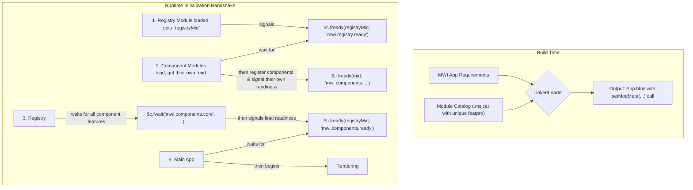
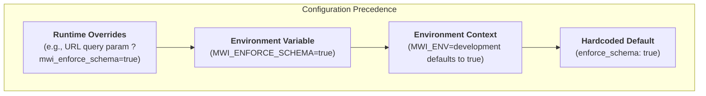
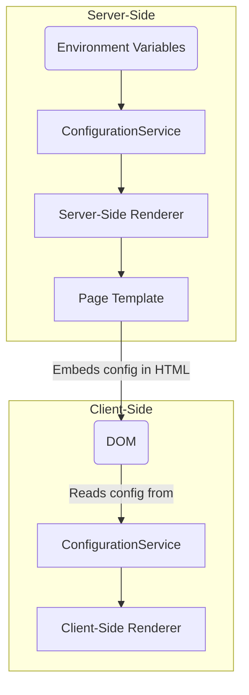

# MWI System Architecture

The Mesgjs Web Interface (MWI) is a bilingual JavaScript-and-Mesgjs system for rendering web interfaces from structured data, supporting both server-side (SSR) and client-side (CSR) rendering.

## High-Level Overview

The system is composed of server-side, client-side, and shared components that work together to securely render dynamic web pages.

```mermaid
graph TD
    subgraph "Browser (Client-Side)"
        CSR[Client-Side Renderer]
        DOM(DOM)
        UserEvents(User Events)
    end

    subgraph "Server-Side (Deno)"
        SSR[Server-Side Renderer]
        PageTemplate[Page Template]
        ModuleResolution[Module Resolution]
        PageData(Page Description Data)
        VNodeServer[VirtualNode (Server)]
    end

    subgraph "Shared Components"
        ComponentRegistry[Component Registry]
        ModuleCatalog[Module Catalog]
        ComponentHandlers(Component Handlers)
    end

    UserEvents --> CSR
    CSR --> DOM
    PageData --> SSR
    SSR --> ComponentRegistry
    SSR --> VNodeServer
    VNodeServer -- ".outerHTML" --> PageTemplate
    ComponentRegistry --> ModuleResolution
    ModuleResolution --> ModuleCatalog
    ModuleCatalog --> ComponentHandlers
```

## Core Mechanisms

*   **Event & Validation Handling:** Event handling and validation logic are implemented by "smart" components. This logic can then be exposed declaratively (e.g., via `v.*` attributes for validation on an input field component), allowing simpler, declarative components to leverage the underlying smart-component functionality.
*   **Dynamic Document Schema:** The schema is not static; it's generated dynamically based on the components available to the current user. Each component declares its own schema (allowed parents, children, attributes), which is enforced by the renderers.
*   **VirtualNode Abstraction:** To manage the complexity of the bilingual (JavaScript/Mesgjs) environment, the rendering pipeline uses a `VirtualNode` class. This class acts as a proxy, providing a unified interface for manipulating node properties (like attributes and classes) and children, regardless of whether the source data is a JS Array or a NANOS list. The server-side `VirtualNode` renders to an HTML string, while the client-side equivalent will render to a DOM element.
*   **Reactive Property Parity:** The VNode implementation ensures that reactive properties (such as `class` and `style`) have full feature parity with their static counterparts. The reactive update pathway leverages the same underlying `editClass()` and `editStyle()` logic, correctly processing complex object-based values rather than simply stringifying them.

## Rendering Pipelines

*   **Server-Side Renderer (SSR):** Takes structured page data, converts it into a tree of `VirtualNode` objects, and then renders that tree into a complete HTML document using a `PageTemplate`.
*   **Client-Side Renderer (CSR):** Can "hydrate" an SSR-rendered page to make it interactive, or render a page from scratch. It supports reactive content updates via the Mesgjs `@reactive` interface.

### Declarative, Single-Pass Rendering

To support advanced features like multi-plane layouts and resource deduplication, the rendering pipeline follows a declarative, single-pass model. This is achieved through a system of structured "payload" objects returned by component handlers, which are then processed into a `VirtualNode` tree.

*   **Bilingual Data Handling:** The `VirtualNode.fromData()` static factory method on the base `MWIVNode` class is the single, unified entry point for creating VNodes. It accepts either native JavaScript Arrays or Mesgjs (`@list`/NANOS) data and normalizes it into a consistent `VirtualNode` instance. This abstracts the complexity of data parsing away from the renderers and component handlers.
*   **Component Payloads:** Component handlers operate on and return `VirtualNode` instances or payloads that describe their output and resource needs.
    *   **`content` Payloads:** High-level semantic components act as macros. They return a `content` property containing a new Mesgjs data structure. The renderer recursively processes this content into child `VirtualNode`s.
    *   **`VirtualNode` Payloads:** Low-level `h.*` primitive components are the rendering engines. Their handlers configure and return a `VirtualNode` instance. The final conversion to HTML (on the server) or a DOM element (on the client) is handled by the renderer at the end of the process.
*   **Centralized Logic:** The `MWISSR` is responsible for traversing the page data, creating the `VirtualNode` tree, and centralizing all aggregation and deduplication logic. It recursively processes `content` payloads and assembles the final output from the root `VirtualNode`. This keeps the semantic component handlers pure and declarative.
*   **Single Pass:** The renderer traverses the page data tree only once. During this pass, it collects all resources (styles, scripts, static blocks) and generates the main body `VirtualNode` tree simultaneously. After the traversal is complete, it assembles the final `PageTemplate` with the deduplicated resources.

#### Advanced Payload Features

To further enhance component encapsulation and developer experience, the payload system supports several advanced features:

*   **Intrinsic Scoped CSS:** Components can provide a `scopedCss` property at the top level of their payload. This property contains a CSS template string.
    *   **Scoping Mechanism:** For each page render, the renderer generates a unique scope ID (e.g., `mwi-a1b2`, likely from a hex-based counter) for each component *type* that provides scoped CSS. This ID works in conjunction with the element instance ID system (see [`Naming-Conventions.md`](../../architectural-plan/Naming-Conventions.md)) to ensure proper style encapsulation.
    *   **Substitution:** The renderer replaces all instances of a special marker (`@@`) within the `scopedCss` template and assigns the scope ID to the `VirtualNode`. The `VirtualNode`'s final rendering step (`.outerHTML`) performs the substitution in the generated HTML.

## Key Interfaces

*   **Component Registry:** A unified registry for component specifications. The renderer queries this registry directly to retrieve the `componentSpec` (handler and options) needed to render a given component type.
*   **Page-Template Object:** Manages the overall HTML page structure. It supports a modular, position-based system (e.g., "head", "body", "sidebar") for adding content, inspired by Joomla's template positions. This allows for flexible and dynamic page composition.

## Pub/Sub Communication

To facilitate loosely-coupled communication between components (e.g., a form input and its parent form), MWI implements a reactive publish-subscribe system. This system allows components to publish their interfaces to a global, path-based registry and subscribe to other interfaces.

The entire mechanism is built on top of the `@reactive` interface, ensuring that timing and mount/unmount lifecycle issues are handled gracefully. Components can reactively appear and disappear without causing errors in their dependents.

The full details of this system are documented in [`architectural-plan/MWI-PubSub-Architecture.md`](../../architectural-plan/MWI-PubSub-Architecture.md).

## Module & Component Architecture

The MWI component system is designed to be modular, secure, and tightly integrated with the Mesgjs module-loading ecosystem. It uses a multi-stage feature-promise handshake for initialization, ensuring correctness and preventing race conditions.

### Guiding Principles

-   **Security First:** Component capabilities are defined by trusted modules, and feature readiness is signaled using a unique, runtime-provided module ID (`mid`).
-   **Build-Time Resolution:** Component availability and versioning are resolved at build time by the `msjsload-cli` tool.
-   **Asynchronous, Race-Free Initialization:** The system uses the Mesgjs feature-promise mechanism (`$c.fwait`/`$c.fready`) to orchestrate a safe, non-blocking startup sequence.
-   **SSR/CSR Parity:** The client hydrates using the exact module metadata and initialization sequence as the server.

### Build & Runtime Lifecycle

The architecture relies on a clear separation between the build-time process and the application's synchronous runtime behavior.



#### 1. Build Process & Feature Signaling
The MWI application is built by `msjsload-cli`. Modules providing components must declare a **unique** feature promise in their catalog entry's `featpro` field.

-   **Convention:** `mwi.components.<unique.moduleName>`
-   **Example:** The `mwi-html-core` module declares `featpro: "mwi.components.mwi.html.core"`.
- In general, hierarchies should be dot-separated, and multi-word levels should be camelCased.
- Longer example: `mwi.components.mwi.html.coreFeatures`

#### 2. The `loadMsjs(mid)` Contract
Every Mesgjs module, when loaded by the runtime, has its exported `loadMsjs` function called with a unique `mid` (module ID). This `mid` is the authorization token required to signal readiness for features declared in that module's metadata.

#### 3. Runtime Initialization Handshake
The system uses a four-stage, promise-based handshake to initialize correctly.

##### Stage 1: Registry Becomes Ready
The MWI application has a core "registry" module. When its `loadMsjs(mid)` function is called, it instantiates the `MWIComponentRegistry` and immediately signals that the registry is ready to accept components:
`$c.fready(mid, 'mwi.registry.ready');`

##### Stage 2: Component Modules Register Themselves
The `loadMsjs(mid)` function in each component module performs the following actions:
1.  It calls `$c.fwait('mwi.registry.ready')`.
2.  In the `.then()` block of the returned promise, it calls a function to push its component definitions into the now-available registry.
3.  Finally, it signals its own completion using its unique `mid`: `$c.fready(mid, 'mwi.components.<moduleName>');`

##### Stage 3: Component System Becomes Ready
After signaling its own readiness in Stage 1, the `MWIComponentRegistry` module proceeds to its next task:
1.  It scans the runtime module metadata to get a list of all expected component feature names (i.e., all `featpro` strings starting with `mwi.components.`).
2.  It calls `$c.fwait()` with this complete list of feature names.
3.  When this second `fwait` promise resolves, it calls `$c.fready()` with its own `mid` to signal that the entire component system is ready: `$c.fready(registryMid, 'mwi.components.ready');`

##### Stage 4: Application Renders
The main MWI application logic is wrapped in a single, final startup call: `$c.fwait('mwi.components.ready').then(() => { /* ... start rendering ... */ });`. This ensures that rendering only begins after the entire component system has been safely and fully initialized.

### Component Authoring

The definitive guide for creating MWI-compliant components, including the "no build step," single-file component architecture and the Mesgjs-native import/export pattern, is documented in [`architectural-plan/mwi-component-authoring-guide.md`](../../architectural-plan/mwi-component-authoring-guide.md). All new component development must adhere to the patterns established in this guide.

## Configuration Service

The `ConfigurationService` provides a flexible, layered system for managing system behavior, such as toggling schema validation for performance. The configuration is resolved by checking sources in a specific order of precedence.



*   **`mwi_enforce_schema`:** A boolean flag that controls whether component structural schema validation is performed.
    *   `true`: (Default for development) Enforces validation for maximum correctness.
    *   `false`: (Default for production) Bypasses structural validation for maximum performance. Input validation is always performed regardless of this setting.
*   **`MWI_ENV`:** An environment variable that sets the operational context.
    *   `'development'`: The default context, which sets `mwi_enforce_schema` to `true`.
    *   `'production'`: Optimizes for performance, setting `mwi_enforce_schema` to `false`.

The `MWI_ENFORCE_SCHEMA` environment variable and runtime overrides allow for explicit control that can override the context-based default.
### Server-to-Client Synchronization

For the configuration to be consistent between the server-side and client-side renderers, the resolved server-side configuration must be passed to the client. The `PageTemplate` object facilitates this transfer.

1.  **Server-Side Resolution:** The server-side `ConfigurationService` resolves the final configuration.
2.  **Embedding in HTML:** The Server-Side Renderer (SSR) serializes the resolved configuration and embeds it within a `<script>` tag in the page's `<head>`.
3.  **Client-Side Hydration:** Upon page load, the client-side `ConfigurationService` reads the configuration from the script tag to initialize its own state, ensuring both environments are synchronized.



## Architectural Integrity

It is a core principle of this project that the architectural documentation is as critical as the source code itself. **Any code change that impacts the system's architecture is incomplete until the corresponding architectural documents have been updated.**

Failure to keep the architectural documentation synchronized with the implementation is a significant risk to the project. It introduces architectural drift, makes onboarding new developers difficult, and complicates future maintenance and development efforts. It is a process failure equivalent to not updating other source code files that are impacted by a change.

Ideally, non-trivial changes (of more than a few lines, or more than one file) should be implemented in an interruptible-and-restartable process, i.e.:
- The changes to be made, in sufficient detail to implement in a different task, should be described in the architecture documentation (potentially as a referenced external file if substantial) before code changes begin.
- The code changes should be implemented.
- The documentation should be updated to cleanly reflect the modified architecture.
- If changes will be significant, consider archiving the existing architecture and creating a new architecture document.
- If there is any doubt as to whether changes warrant this approach, check with the user before proceding.