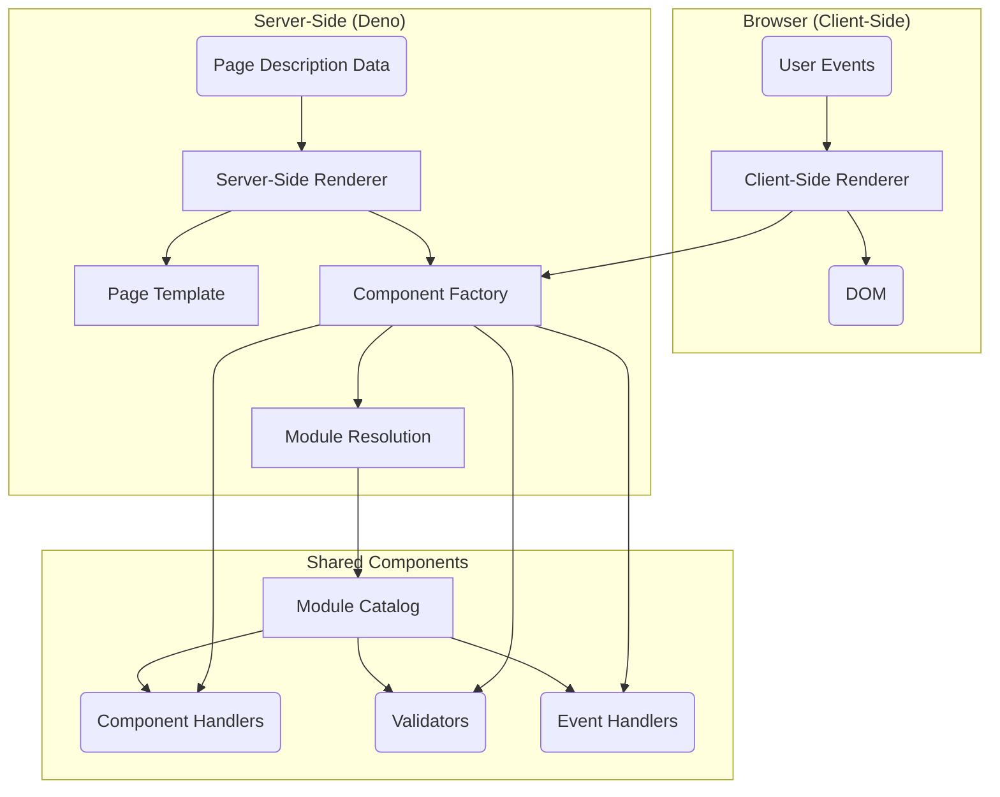
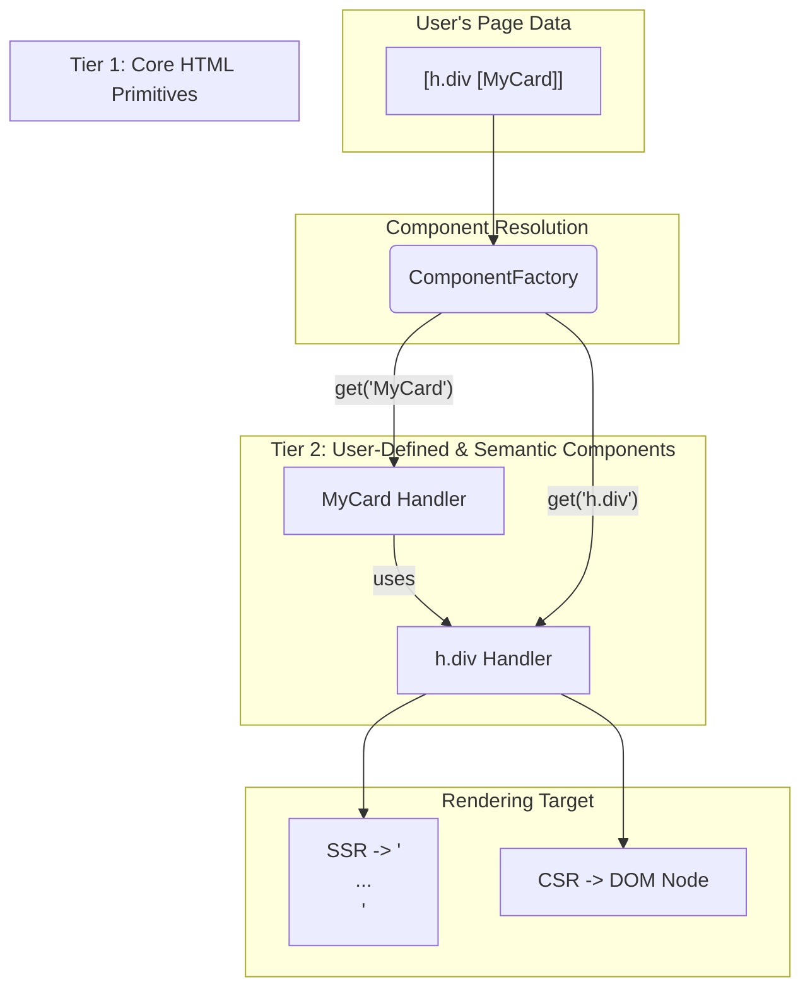
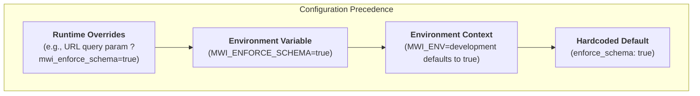
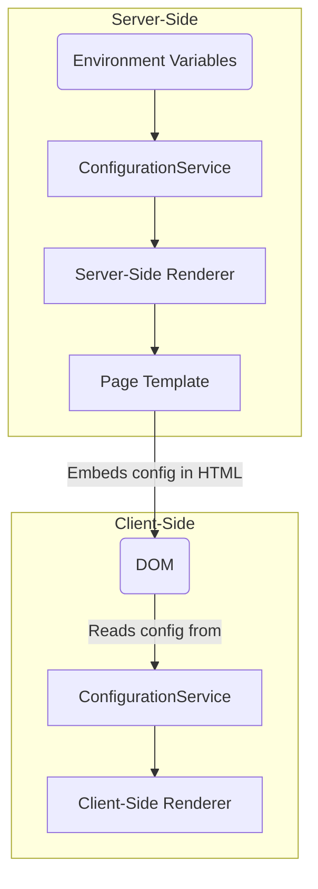

# MWI System Architecture

The Mesgjs Web Interface (MWI) is a bilingual JavaScript-and-Mesgjs system for rendering web interfaces from structured data, supporting both server-side (SSR) and client-side (CSR) rendering.

## High-Level Overview

The system is composed of server-side, client-side, and shared components that work together to securely render dynamic web pages.

## Core Mechanisms

*   **Event & Validation Handling:** Event handlers and validators are referenced by symbolic names (e.g., `:click`, `:validate.email`) in the page data. These are resolved at runtime by the `ComponentFactory` via a three-layer module resolution system.
*   **Dynamic Document Schema:** The schema is not static; it's generated dynamically based on the components available to the current user. Each component declares its own schema (allowed parents, children, attributes), which is enforced by the renderers.

## Rendering Pipelines

*   **Server-Side Renderer (SSR):** Takes structured page data, uses the `ComponentFactory` to get component handlers, and assembles a complete HTML document using a `PageTemplate`.
*   **Client-Side Renderer (CSR):** Can "hydrate" an SSR-rendered page to make it interactive, or render a page from scratch. It supports reactive content updates via the Mesgjs `@reactive` interface.

### Declarative, Single-Pass Rendering

To support advanced features like multi-plane layouts (e.g., modals, panels) and resource deduplication (for CSS, JS, and reusable HTML blocks), the rendering pipeline follows a declarative, single-pass model. This is achieved through a system of structured "payload" objects returned by component handlers.

*   **Component Payloads:** Component handlers do not return HTML directly. Instead, they return a payload object that describes their output and resource needs.
    *   **`content` Payloads:** High-level semantic components act as macros. They return a `content` property containing a new Mesgjs data structure, effectively transforming their own definition into a more primitive one.
    *   **`html` Payloads:** Low-level `h.*` primitive components are the rendering engines. They are the only components that return a final `html` string.
*   **Centralized Logic:** The `SsrRenderer` is responsible for traversing the page data, receiving these payloads, and centralizing all aggregation and deduplication logic. It recursively processes `content` payloads and assembles the final output from `html` payloads. This keeps the semantic component handlers pure and declarative.
*   **Single Pass:** The renderer traverses the page data tree only once. During this pass, it collects all resources (styles, scripts, static blocks) and generates the main body HTML simultaneously. After the traversal is complete, it assembles the final `PageTemplate` with the deduplicated resources.

## Key Interfaces

*   **Component-Handler Factory:** A unified factory with a `get(symbolicName)` method to find and instantiate components, validators, and event handlers. It is the public interface to the module resolution system.
*   **Page-Template Object:** Manages the overall HTML page structure. It supports a modular, position-based system (e.g., "head", "body", "sidebar") for adding content, inspired by Joomla's template positions. This allows for flexible and dynamic page composition.

## Component Architecture

To balance ease of use for novice users with the flexibility required by experienced developers, MWI uses a two-tier component architecture with specific naming conventions. These are conventions, not strict rules, and may be enforced with warnings during development.

### Naming Conventions

1.  **Core HTML Primitives (`h.<tagname>`)**
    *   **Convention:** A short namespace followed by a dot and the HTML tag name (e.g., `h.div`, `h.p`, `h.a`).
    *   **Purpose:** Provides direct, low-level access to HTML elements. This layer is platform-agnostic, responsible for creating either an HTML string (SSR) or a DOM element (CSR).

2.  **Built-in Semantic Components (`camelCase`)**
    *   **Convention:** `camelCase` or `lowercase` (e.g., `button`, `textInput`, `userProfileCard`).
    *   **Purpose:** These are the standard, high-level building blocks provided by MWI. They are designed to be easy to use and often encapsulate accessibility (a11y) best practices.

3.  **User-Defined Components (`PascalCase` or `Capital-Kebab-Case`)**
    *   **Convention:** Must begin with an uppercase letter. Can use `PascalCase` (e.g., `MyButton`) or `Capital-Kebab-Case` (e.g., `My-Button`). For organization, a `Collection.Component` pattern is also valid (e.g., `SuperForm.Input`).
    *   **Purpose:** Creates a clear distinction between built-in and user-supplied components, preventing naming collisions and improving readability.

### The Mapping Layer
The mapping/alias layer is the final authority for resolving component names. It can be used to resolve naming conflicts between different component libraries or to create short aliases for frequently used components, providing an extra layer of flexibility.

## Module & Component Management

A three-layer module resolution system ensures security and extensibility:
1.  **Module Catalog:** The source of truth, storing modules with metadata like version, integrity hash, and access controls.
2.  **Mapping/Alias Layer:** Maps symbolic names to specific module versions for centralized control.
3.  **Registry/Runtime Layer:** Resolves names, enforces security policies, and loads module code at runtime.
## Configuration Service

The `ConfigurationService` provides a flexible, layered system for managing system behavior, such as toggling schema validation for performance. The configuration is resolved by checking sources in a specific order of precedence.

*   **`mwi_enforce_schema`:** A boolean flag that controls whether component structural schema validation is performed.
    *   `true`: (Default for development) Enforces validation for maximum correctness.
    *   `false`: (Default for production) Bypasses structural validation for maximum performance. Input validation is always performed regardless of this setting.
*   **`MWI_ENV`:** An environment variable that sets the operational context.
    *   `'development'`: The default context, which sets `mwi_enforce_schema` to `true`.
    *   `'production'`: Optimizes for performance, setting `mwi_enforce_schema` to `false`.

The `MWI_ENFORCE_SCHEMA` environment variable and runtime overrides allow for explicit control that can override the context-based default.
### Server-to-Client Synchronization

For the configuration to be consistent between the server-side and client-side renderers, the resolved server-side configuration must be passed to the client. The `PageTemplate` object facilitates this transfer.

1.  **Server-Side Resolution:** The server-side `ConfigurationService` resolves the final configuration.
2.  **Embedding in HTML:** The Server-Side Renderer (SSR) serializes the resolved configuration and embeds it within a `<script>` tag in the page's `<head>`.
3.  **Client-Side Hydration:** Upon page load, the client-side `ConfigurationService` reads the configuration from the script tag to initialize its own state, ensuring both environments are synchronized.

