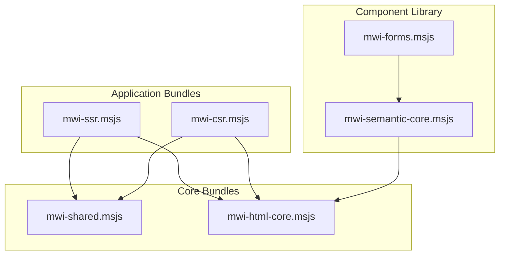

---
**Status:** ACTIVE
**History:**
- 2025-07-29: ACTIVE
- 2025-07-29: DRAFT
**Scope:** This document proposes a Mesgjs-native approach to bundling MWI JavaScript modules, avoiding external build tools.
**Replaces:** 
**Replaced by:** 
**Related:** 
---

# MWI Bundling Design Proposal

This document outlines a design for bundling the MWI JavaScript modules into Mesgjs modules. This approach avoids an external build step (like Rollup or Webpack) in favor of a more integrated, Mesgjs-native solution.

## Core Concept: In-Source Bundling with `@js`

Instead of an external build tool, we will create `.msjs` Mesgjs source files (and companion `.slid` files for supplemental configuration) that directly embed the necessary JavaScript code using the `@js{ @}` block. The `msjstrans` command-line tool generates the integrity hash, module catalog entries, etc., keeping the bundling logic within the Mesgjs ecosystem itself.

## Proposed Bundle Structure

The MWI application will be divided into the following granular bundles:

*   **`mwi-ssr.msjs`**: The server-side rendering engine.
*   **`mwi-csr.msjs`**: The client-side rendering and hydration engine.
*   **`mwi-shared.msjs`**: Core shared utilities (`MWIConfigService`, `MWIVNode` base class, etc.). This will be a dependency for both SSR and CSR bundles.
*   **`mwi-html-core.msjs`**: The foundational, low-level HTML component definitions (e.g. `h.div`, `h.span`).
*   **`mwi-semantic-core.msjs`**: Higher-level semantic components that compose the `mwi.html.core` components (e.g. a `card` or `button` component).
*   **`mwi-forms.msjs`**: Contains all form-related components (e.g. `form`, `input`, `label`).

### Dependency Graph

Each `.msjs` file will also have a corresponding `.slid` file (e.g. `mwi-shared.msjs` and `mwi-shared.slid`) for recording its module dependencies; these are omitted from the diagram for brevity.




## The `@js` Embedding Pattern

Each `.msjs` bundle will be structured as a Mesgjs module. The JavaScript code that is currently in separate `.esm.js` files will be consolidated and placed inside an `@js{ @}` block within the corresponding `.msjs` file.

### Example: `mwi-ssr.msjs`

```mesgjs
// mwi-ssr.msjs - Server-Side Rendering Bundle

[(
  modpath = mwi/ssr
  version = 0.1.0
  featpro = 'mwi.ssr.bundle'
  featreq = 'mwi.shared.bundle mwi.html.core.bundle'
)]

// Defines the public interface for the SSR bundle.
@c(interface mwiSsrBundle)(set handlers=[
    // The @init handler runs when an instance is created.
    @init = {
        // Here, the bridge to the JS API would be established.
        // The details are TBD and part of the project's technical debt.
        
        // After setup, wait for dependencies to be ready.
        // The @c(fwait) message returns a promise, so we chain (then).
        @c(fwait 'mwi.shared.bundle' 'mwi.html.core.bundle')(then {
             @c(log 'SSR Bundle Initialized')
        })
    }
    
    // An example public message for this interface.
    renderPage = {
        // This handler would use the established JS API to perform rendering.
        // For example: %(at jsApi)(render !(at 0))
    }
])

// All the JavaScript source code for the SSR engine is embedded here.
@js{
    // All the code from the following files would be combined here:
    // - src/server/MWISSR.esm.js
    // - src/server/MWISSRVNode.esm.js
    // - etc...

    class MWISSR {
        // ... implementation ...
    }

    // ... other classes and functions ...
@}
```

## Proposed Development Workflow

1.  Continue to develop in separate, modular `.esm.js` files for ease of organization and code navigation, but with the realization that this results in **significant** technical debt.
2.  After all the foundational components have been tested and are ostensibly working as desired, permanently replace the collected `.esm.js` files with proper `.msjs` + `.slid` file pairs.

This provides the organizational benefits of separate files during development (though at a not-insignificant cost) while achieving the goal of a single, self-contained Mesgjs module with no external build-tool dependency for the final artifact.

## User Updates

- I do not want to use any extra-Mesgjs-ecosystem build steps
  - No JS-style build step (e.g. rollup, esbuild, vite)
  - No custom assembly scripts (e.g. deno tasks, shell scripts, Makefiles)
- Related source code should either live in the same .msjs Mesgjs source file, or be shared via a standard (native) Mesgjs pattern (i.e. interfaces, instances, fwait/fready feature sync system)
- In lieu of static JS imports, a dynamic-import-like pattern should be used:
  - For *exports*:
    - Create an Mesgjs interface (a singleton, where appropriate)
    - Instantiate any jS-level objects within the interface's `@init` handler
    - If there's a singular or primary object, assign this to d.octx.js
    - You can create an `'@jsv': d => d.js,` handler to return it, however this is *typically* only used for JS primitive values (e.g. so that adding numbers can work on any combination of JS numbers or Mesgjs `@number` instances).
    - You can also bind this to the public interface function so that it is available directly as a JS property (without having to message the object):\
    `setRO(d.rr, 'jsv', instance);`
    - You can bind multiple values to more specific property names if necessary.
    - Issue a `$c.fready(mid, interface);` when the interface is ready for consumption.
  - For *imports*:
    - `$c.fwait(interface).then(...)` (or await) to wait for the required interface(s) to become available.
    - Get an instance: `const instance = $c.getInstance(interface);`
    - You can then access the `.jsv` (or other) properties of `instance` that were bound to `d.rr` by the interface's `@init` handler.

### Important Notes About JS Embeds

- A `@js{ ... @}` embed *before* the first non-comment line will appear outside of the `export function loadMsjs (mid) {` boilerplate.
- A `@js{ ... @}` embed *after8 the first non-comment line will appear inside of the `export function loadMsjs (mid) {` boilerplate.
- `@js{ /* before loadMsjs */ @} '' /* Empty string is a NCL */ @js{ /* inside loadMsjs */ @}`
- It's a good idea to `if (!mid) throw new Error` in modules dealing with imports/exports. If `mid` is not set, module management hasn't been enabled (no `setModMeta` call to the runtime), so `fwait` and `fready` won't work.