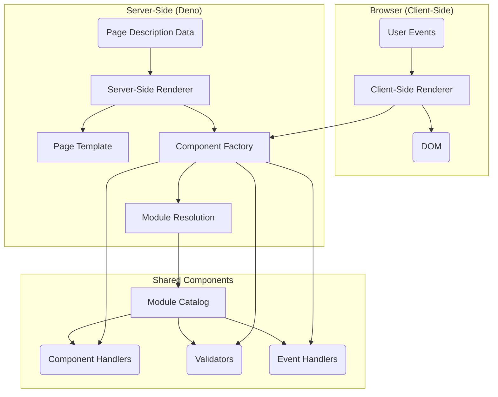

### **MWI Architectural Plan**

This plan outlines the architecture for the Mesgjs Web Interface (MWI), a bilingual JavaScript-and-Mesgjs system for rendering web interfaces from structured data.

#### **1. High-Level Architecture Overview**

The MWI will be composed of several key services that work together to render pages on both the server and the client. The architecture is designed to be secure, extensible, and maintainable.

Here is a diagram illustrating the main components and their interactions:

#### **2. Core Mechanisms**

These are the foundational systems that enable the dynamic and secure nature of the MWI.

*   **Event-Handler & Input-Validation Mechanism:**
    *   **Symbolic Referencing:** In the page description data, event handlers and validators will be referenced by symbolic names (e.g., `:click`, `:validate.email`).
    *   **Resolution:** The `ComponentFactory` will be responsible for resolving these symbolic names to actual implementations at runtime via the three-layer module resolution system.
    *   **Execution:**
        *   On the **server**, validators will be executed by the SSR during data processing.
        *   On the **client**, the CSR will attach event handlers to DOM elements. When an event fires, the corresponding Mesgjs event handler will be executed in a sandboxed environment.

*   **Document Schema Mechanism:**
    *   **Dynamic Generation:** A document schema will not be static. Instead, it will be dynamically generated based on the components available to the current user, according to their permissions and the loaded modules.
    *   **Component-Driven:** Each component will declare its own schema, including allowed parent/child elements, attributes, and registered events.
    *   **Enforcement:** The SSR and CSR will use this dynamic schema to validate the page structure during rendering, ensuring that only allowed components and configurations are used.

*   **Component Handler Mechanism:**
    *   **Hybrid Nature:** To balance ease of use with flexibility, component handlers can be either static data structures or executable functions. This allows simple components to be purely declarative while enabling complex components to contain conditional logic.
    *   **Handler Types:**
        1.  **Static Data:** A `NANOS` object. This is the simplest form, used for purely declarative components that always render the same structure.
        2.  **Mesgjs Function:** A Mesgjs `@function` object. This allows for sandboxed, secure, user-defined logic within a component (e.g., conditionally rendering an `<a>` vs. a `<button>`).
        3.  **JavaScript Function:** A native JavaScript `Function`. Reserved for trusted, platform-level components where performance is critical. These handlers can only be loaded from specific, trusted internal modules to mitigate security risks.

#### **3. Rendering Pipelines**

The MWI will support both server-side and client-side rendering.

*   **Server-Side Renderer (SSR):**
    *   **Input:** Takes structured page description data (NANOS or JS object format).
    *   **Process:**
        1.  Traverses the data structure.
        2.  For each element, it requests a component handler from the `ComponentFactory`.
        3.  The `ComponentFactory` resolves the handler. If the handler is an executable function (JS or Mesgjs), the factory invokes it with the component's attributes to get a render payload. If the handler is static data, that data is the payload.
        4.  The SSR processes the payload. It recursively expands `content` payloads and collects `html`, `scopedCss`, and other resources.
        5.  It assembles the final HTML document using a `PageTemplate` object, injecting the deduplicated resources into the appropriate sections.
    *   **Output:** A complete HTML document.

*   **Client-Side Renderer (CSR):**
    *   **Hydration:** The CSR will be able to "hydrate" a page rendered by the SSR, attaching event listeners and making the page interactive without a full re-render.
    *   **Dynamic Rendering:** The CSR will also be able to render a page from scratch or update portions of the DOM in response to user events or data changes, using the same component handlers as the SSR.
    *   **Reactivity:** It will support reactive content through the Mesgjs `@reactive` interface, allowing components to update themselves efficiently.

#### **4. Key Interfaces**

These are the primary contracts that define how the different parts of the system communicate.

*   **Component-Handler Factory Interface:**
    *   **Responsibility:** A unified "resource factory" for finding and instantiating components, validators, and event handlers.
    *   **Method:** A single `get(symbolicName)` method that returns a `Promise`. The promise will resolve to the requested handler or `undefined` if it's not found or not permitted. The resolved handler may be a `NANOS` object (static data), a Mesgjs `@function`, or a native JavaScript `Function`.
    *   **Security:** The factory is responsible for enforcing the security policy that restricts native JavaScript function handlers to trusted, internal modules only. It must prevent wrapped Mesgjs functions from being treated as trusted native functions.
    *   **Implementation:** This factory will be the public face of the three-layer module resolution system.

*   **Page-Template Object Interface:**
    *   **Responsibility:** Manages the overall structure of the final HTML page.
    *   **Messages:**
        *   `(getPositions)`: Returns a list of available content positions (e.g., `main`, `head-scripts`, `body-scripts`).
        *   `(setContent position content)`: Places content into a specified position.
        *   `(render)`: Returns the final, assembled HTML string.

#### **5. Module & Component Management**

This is the system for managing, securing, and resolving all executable code.

*   **Three-Layer Module Resolution:**
    1.  **Module Catalog:** The single source of truth. Stores modules (components, validators, etc.) with metadata like version, integrity hash (sha512), and access control lists.
    2.  **Mapping/Alias Layer:** Maps symbolic names to specific module versions. This allows for centralized control and easy updates. For example, the name `button` could map to `button-v2.1.0`.
    3.  **Registry/Runtime Layer:** The runtime component that uses the mapping layer to resolve a symbolic name, enforces security policies, and loads the module code.

*   **Component Schema:**
    *   Each component will have an associated schema defining:
        *   `id`, `name`, `description`
        *   Allowed parent and child elements.
        *   Registered events (e.g., `click`, `:render`, `:validate`).

#### **6. Addressing Open Issues**

This architecture provides a solid foundation for addressing the open issues mentioned in the requirements:

*   **SAAS Gaps & Performance:** The modular nature and policy enforcement in the module resolution system will allow for adding features like rate limiting and resource quotas for different account tiers.
*   **Integration & Error Reporting:** The messaging-based nature of the system allows for dedicated channels for permissions, errors, and warnings, which can be surfaced to the UI or logs.
*   **SSR/CSR Challenges:** The shared component model and well-defined interfaces for renderers and page templates will facilitate tackling complex issues like SSR hydration and child node processing.
#### **7. Coding Conventions**

*   **Private Properties:** Class properties and methods intended for internal use should be prefixed with a single underscore (`_`). This convention is preferred over JavaScript's native private fields (`#`) to allow for more flexible subclassing and extension by developers who may need to override or access these properties in derived classes.