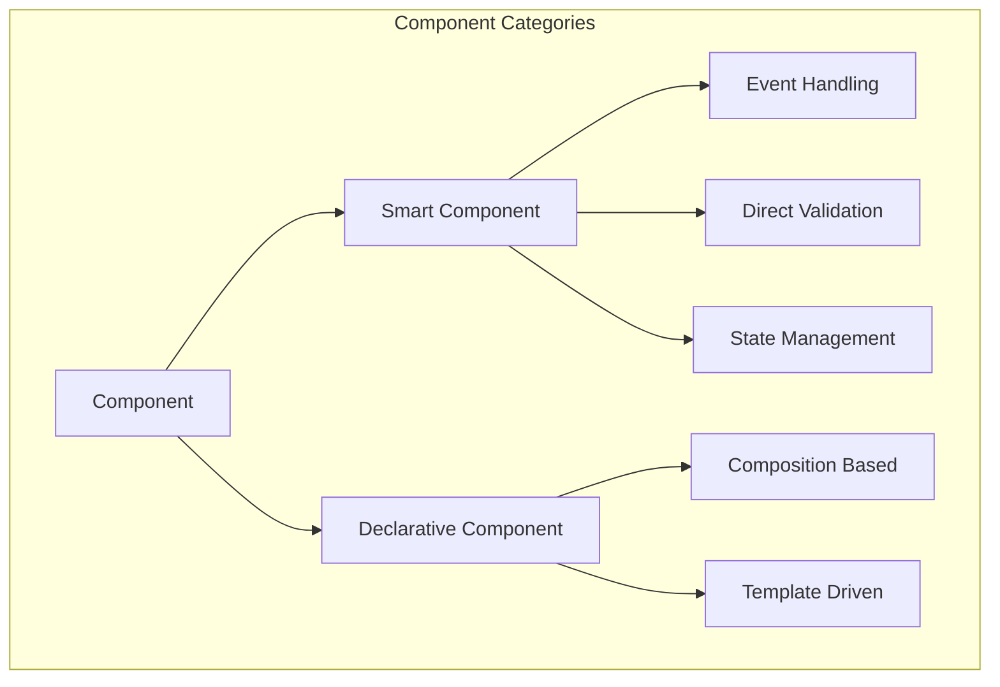
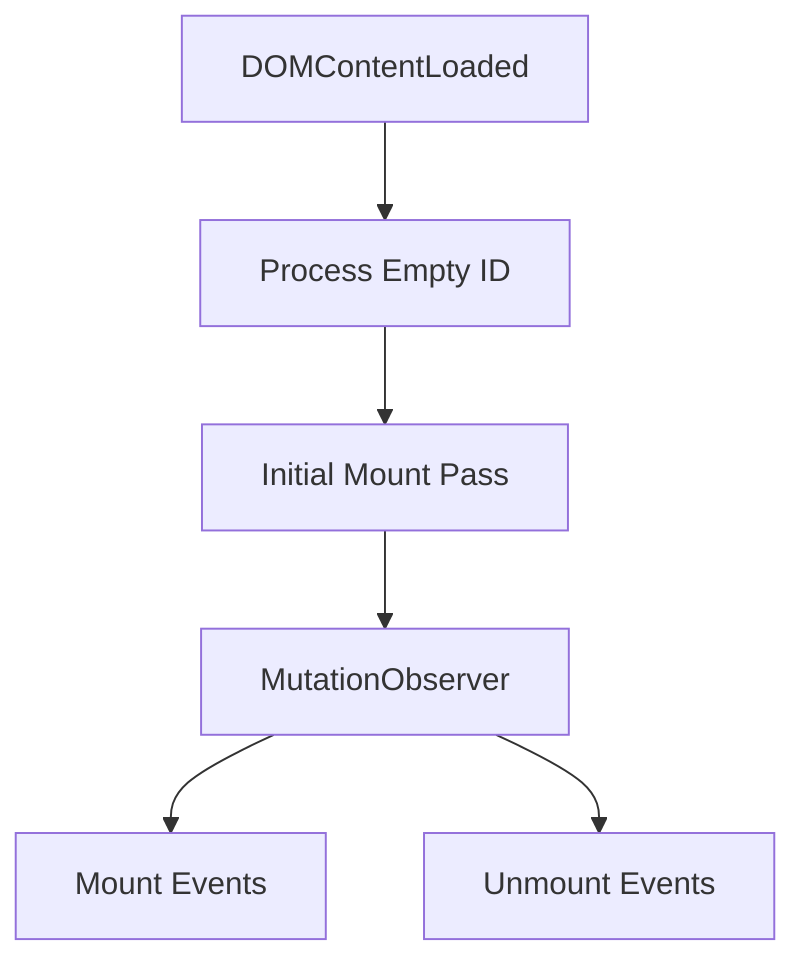

# MWI Component Lifecycle

This document details the component lifecycle system for the Mesgjs Web Interface (MWI), focusing on component handlers, state management, and the mount/unmount system.

## Component Types



### Smart Components
- Full lifecycle control
- Direct event handling
- State management
- Shadow DOM support

### Declarative Components
- Template-based rendering
- Composition with smart components
- Static structure
- Resource declarations

## Mount/Unmount System

### Mount Monitor (MUM)



1. **Subscription Types:**
   ```typescript
   type EventType = 'mount' | 'unmount';
   
   interface MountHandler {
       module: string;
       interface: string;
       message: any;
       type: EventType;
       once?: boolean;
   }

   class MWIMUM {
       private subscriptions: Map<string, Set<MountHandler>>;
       
       subscribe(
           elementId: string,
           handler: MountHandler
       ): Symbol {
           const id = Symbol();
           if (!this.subscriptions.has(elementId)) {
               this.subscriptions.set(elementId, new Set());
           }
           this.subscriptions.get(elementId)!.add(handler);
           return id;
       }
   }
   ```

2. **Event Processing:**
   ```typescript
   class MWIMUM {
       private async processMutation(mutation: MutationRecord) {
           if (mutation.type === 'attributes') {
               // Handle ID attribute changes
               const element = mutation.target as Element;
               const newId = element.id;
               const oldId = mutation.oldValue;

               if (oldId && this.subscriptions.has(oldId)) {
                   // Process unmount for old ID
                   await this.processHandlers(element, 'unmount');
               }
               if (newId && this.subscriptions.has(newId)) {
                   // Process mount for new ID
                   await this.processHandlers(element, 'mount');
               }
               return;
           }

           // Handle added/removed nodes
           const processNodes = (nodes: NodeList, type: EventType) => {
               for (const node of nodes) {
                   if (!(node instanceof Element)) continue;
                   
                   // Only process if node has ID and we have subscriptions
                   const id = node.id;
                   if (id && this.subscriptions.has(id)) {
                       this.processHandlers(node, type);
                   }

                   // Check children with IDs
                   const children = node.querySelectorAll('[id]');
                   for (const child of children) {
                       const childId = child.id;
                       if (childId && this.subscriptions.has(childId)) {
                           this.processHandlers(child, type);
                       }
                   }
               }
           };

           processNodes(mutation.addedNodes, 'mount');
           processNodes(mutation.removedNodes, 'unmount');
       }

       private async processHandlers(element: Element, type: EventType) {
           const id = element.id;
           if (!id || !this.subscriptions.has(id)) return;

           const handlers = this.subscriptions.get(id)!;
           for (const handler of handlers) {
               if (handler.type !== type) continue;

               try {
                   await this.executeHandler(handler, element);
                   if (handler.once) {
                       handlers.delete(handler);
                   }
               } catch (error) {
                   this.handleError(id, handler, error);
               }
           }
       }
   }
   ```

3. **Initialization:**
   ```typescript
   class MWIMUM {
       init() {
           // Process empty ID handlers first
           this.processHandlers(document.documentElement, 'mount');
           
           // Process mount subscriptions by ID lookup
           for (const [id, handlers] of this.subscriptions) {
               if (id === '') continue; // Skip empty ID, already processed
               
               const element = document.getElementById(id);
               if (element) {
                   this.processHandlers(element, 'mount');
               }
           }
           
           // Start observing
           this.observer.observe(document.body, {
               childList: true,
               subtree: true,
               attributes: true,
               attributeFilter: ['id'] // Only watch id changes
           });
       }
   }
   ```

## Component Handler Structure

```typescript
interface ComponentHandler {
    // Required: Main render function
    render(data: any): ComponentPayload | any;
}

interface ComponentPayload {
    content: any;
    scopedCss?: string;
    stylesheets?: Set<string>;
    modules?: Set<string>;
    
    // Mount/unmount handlers
    mount?: {
        [elementId: string]: Array<{
            module: string;
            interface: string;
            message: any;
            once?: boolean;
        }>;
    };
    
    unmount?: {
        [elementId: string]: Array<{
            module: string;
            interface: string;
            message: any;
            once?: boolean;
        }>;
    };
}
```

## State Management

### Component State

```typescript
class SmartComponent {
    private state: any;
    private subscribers: Set<(state: any) => void>;
    
    protected setState(newState: any) {
        this.state = newState;
        this.notifySubscribers();
    }
    
    protected getState(): any {
        return this.state;
    }
    
    subscribe(callback: (state: any) => void): () => void {
        this.subscribers.add(callback);
        return () => this.subscribers.delete(callback);
    }
}
```

### Reactive Updates

```typescript
class ReactiveComponent extends SmartComponent {
    render(data: any) {
        return {
            content: ['h.div', {}, [
                ['h.span', {}, this.state.value]
            ]],
            mount: {
                '': [{
                    module: 'components/reactive',
                    interface: 'bind',
                    message: {
                        path: 'value',
                        initial: data.value
                    },
                    type: 'mount'
                }]
            }
        };
    }
}
```

## Shadow DOM Integration

### Private Fields

```typescript
class PrivateFieldComponent {
    render(data: any) {
        return {
            content: ['h.div', { attachShadow: 'open' }, [
                ['h.input', {
                    type: 'text',
                    value: data.value
                }]
            ]],
            scopedCss: `
                :host {
                    display: block;
                }
                input {
                    border: 1px solid #ccc;
                }
            `
        };
    }
}
```

## Error Handling

### Lifecycle Errors

```typescript
class MWIMUM {
    protected handleError(
        elementId: string,
        handler: MountHandler,
        error: Error
    ) {
        console.error(
            `${handler.type} error for ${elementId}:`,
            handler.module,
            error
        );
        
        // Emit warning
        this.emit('warn', {
            code: `${handler.type}-error`,
            elementId,
            module: handler.module,
            message: error.message
        });
        
        // Remove failed handler if once
        if (handler.once) {
            this.subscriptions.get(elementId)?.delete(handler);
        }
    }
}
```

## Future Considerations

1. **Performance:**
   - Batch state updates
   - Optimize mount/unmount detection
   - Lazy state initialization

2. **Features:**
   - Component composition patterns
   - Lifecycle hook expansion
   - Enhanced state management

3. **Developer Experience:**
   - Component debugging tools
   - State inspection
   - Mount/unmount logging