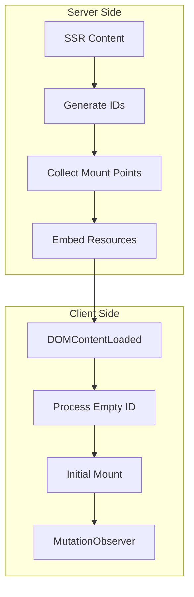
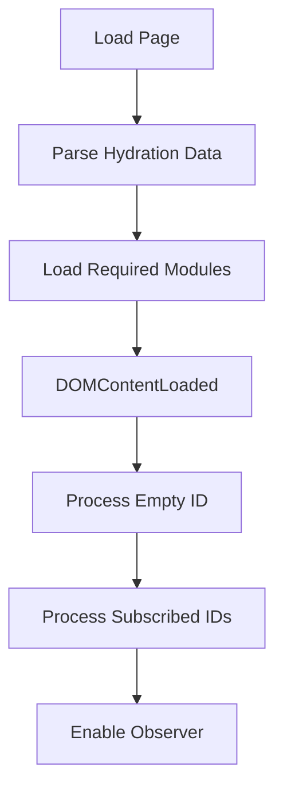

# MWI SSR/CSR Bridge

This document details the hydration system that bridges server-side rendering (SSR) and client-side rendering (CSR) in the Mesgjs Web Interface (MWI).

## Hydration Overview



## Element Identification

### ID Generation
```typescript
class MWIRenderer {
    private idCounter: number = 0;

    protected generateId(prefix: string): string {
        return `${prefix}${this.idCounter++}`;
    }
}

class MWISSR extends MWIRenderer {
    protected generateElementId(): string {
        return this.generateId('MWS$');
    }
}

class MWICSR extends MWIRenderer {
    protected generateElementId(): string {
        return this.generateId('MWC$');
    }
}
```

### ID Assignment Rules
1. SSR generates "MWS$" + counter
2. CSR generates "MWC$" + counter
3. User-defined IDs are preserved
4. Empty ID ('') for global handlers

## Hydration Points

### Collection in SSR
```typescript
interface HydrationPoint {
    id: string;
    handlers: Array<{
        module: string;
        interface: string;
        message: any;
        type: 'mount' | 'unmount';
        once?: boolean;
    }>;
}

class MWISSR {
    private mountPoints: Map<string, HydrationPoint> = new Map();
    
    protected collectMountPoints(payload: ComponentPayload) {
        // Process mount handlers
        if (payload.mount) {
            for (const [id, handlers] of Object.entries(payload.mount)) {
                if (!this.mountPoints.has(id)) {
                    this.mountPoints.set(id, { id, handlers: [] });
                }
                this.mountPoints.get(id)!.handlers.push(
                    ...handlers.map(h => ({ ...h, type: 'mount' }))
                );
            }
        }

        // Process unmount handlers
        if (payload.unmount) {
            for (const [id, handlers] of Object.entries(payload.unmount)) {
                if (!this.mountPoints.has(id)) {
                    this.mountPoints.set(id, { id, handlers: [] });
                }
                this.mountPoints.get(id)!.handlers.push(
                    ...handlers.map(h => ({ ...h, type: 'unmount' }))
                );
            }
        }
    }
}
```

### Embedding in Page Template
```typescript
class MWIPageTemplate {
    injectHydrationPoints(points: Map<string, HydrationPoint>) {
        const data = JSON.stringify(
            Array.from(points.values()),
            null,
            2
        ).replace(/^\s+/gm, '').trim();

        this.addToHead('script', data, {
            type: 'application/json',
            id: 'mwi-hydration'
        });
    }
}
```

## Resource Activation

### Module Loading
```typescript
class MWIHydration {
    private async loadModules(points: HydrationPoint[]) {
        const modules = new Set<string>();
        
        // Collect unique modules
        for (const point of points) {
            for (const handler of point.handlers) {
                modules.add(handler.module);
            }
        }
        
        // Load modules through catalog
        for (const module of modules) {
            await this.moduleLoader.load(module);
        }
    }
}
```

### Handler Activation
```typescript
class MWIHydration {
    private async activateHandlers(points: HydrationPoint[]) {
        const mum = await this.getMUM();
        
        // Register handlers with MUM
        for (const point of points) {
            for (const handler of point.handlers) {
                mum.subscribe(point.id, handler);
            }
        }
    }
}
```

## Placeholder Replacement

### CSR Node Creation
```typescript
class MWICSR {
    replaceNode(id: string, content: any) {
        const oldNode = document.getElementById(id);
        if (!oldNode) return;

        const newNode = this.render(content);
        newNode.id = id;
        oldNode.replaceWith(newNode);
    }
}
```

### State Preservation
```typescript
interface StateContainer {
    id: string;
    state: any;
}

class MWIHydration {
    private stateMap: Map<string, any> = new Map();

    preserveState(id: string, state: any) {
        this.stateMap.set(id, state);
    }

    getPreservedState(id: string): any {
        const state = this.stateMap.get(id);
        this.stateMap.delete(id);
        return state;
    }
}
```

## Initialization Process



### Optimized Mount Process
- Empty ID handlers processed first
- Direct getElementById lookup for subscribed IDs
- Skip DOM traversal for efficiency
- Watch for ID attribute changes

### Hydration Sequence
```typescript
class MWIHydration {
    async init() {
        // Wait for DOMContentLoaded
        if (document.readyState !== 'loading') {
            await this.hydrate();
        } else {
            document.addEventListener('DOMContentLoaded', 
                () => this.hydrate());
        }
    }

    private async hydrate() {
        // Load hydration data
        const data = this.loadHydrationData();
        if (!data) return;

        // Load required modules
        await this.loadModules(data);

        // Initialize MUM
        const mum = await this.getMUM();
        
        // Register handlers
        await this.activateHandlers(data);
        
        // Start monitoring with optimized settings
        mum.observe(document.body, {
            childList: true,
            subtree: true,
            attributes: true,
            attributeFilter: ['id']  // Only watch ID changes
        });
    }
}
```

## Mutation Handling

### ID Changes
```typescript
class MWIHydration {
    private processMutation(mutation: MutationRecord) {
        if (mutation.type === 'attributes') {
            // Handle ID attribute changes
            const element = mutation.target as Element;
            const newId = element.id;
            const oldId = mutation.oldValue;

            if (oldId && this.hasHandlers(oldId)) {
                this.processUnmount(element, oldId);
            }
            if (newId && this.hasHandlers(newId)) {
                this.processMount(element, newId);
            }
            return;
        }

        // Only process nodes with IDs that have handlers
        const processNodes = (nodes: NodeList, type: 'mount' | 'unmount') => {
            for (const node of nodes) {
                if (!(node instanceof Element)) continue;
                
                const id = node.id;
                if (id && this.hasHandlers(id)) {
                    this.processNode(node, type);
                }

                // Check children with IDs
                const children = node.querySelectorAll('[id]');
                for (const child of children) {
                    const childId = child.id;
                    if (childId && this.hasHandlers(childId)) {
                        this.processNode(child, type);
                    }
                }
            }
        };

        processNodes(mutation.addedNodes, 'mount');
        processNodes(mutation.removedNodes, 'unmount');
    }
}
```

## Error Handling

### Hydration Errors
```typescript
class MWIHydration {
    protected handleHydrationError(
        point: HydrationPoint,
        error: Error
    ) {
        console.error(
            `Hydration error for ${point.id}:`,
            error
        );
        
        // Emit warning
        this.emit('warn', {
            code: 'hydration-error',
            elementId: point.id,
            message: error.message
        });
        
        // Continue with remaining points
        return null;
    }
}
```

## Future Considerations

1. **Performance:**
   - Parallel module loading
   - Selective hydration
   - State serialization optimization
   - Further mutation observer optimizations
   - Efficient ID-based lookups

2. **Features:**
   - Progressive enhancement
   - Partial hydration
   - Stream hydration

3. **Developer Experience:**
   - Hydration debugging
   - State inspection
   - Performance monitoring