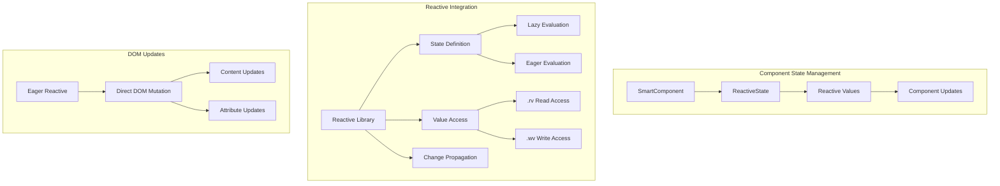

---
**Status:** ACTIVE
**History:**
- 2025-07-29: ACTIVE
**Scope:** Details the integration of the fine-grained reactive library into the MWI architecture.
**Replaces:**
**Replaced by:**
**Related:** MWI-Architecture-v3-Core.md
---
# MWI Reactive Architecture

This document details the integration of the fine-grained reactive library into the Mesgjs Web Interface (MWI) architecture.

## Overview

The reactive system provides:
- Fine-grained dependency tracking
- Lazy/eager evaluation options
- Memoization support
- Batch updates
- Clear separation between read-only (.rv) and writable (.wv) access



## Implementation

### Enhanced SmartComponent Base Class

```typescript
class SmartComponent {
    private reactiveState: Map<string, Reactive>;
    private domUpdaters: Set<Reactive>;
    
    protected defineState(key: string, options: {
        value?: any,
        def?: (oldValue: any) => any,
        eager?: boolean,
        compare?: (a: any, b: any) => boolean
    }) {
        const r = reactive(options);
        this.reactiveState.set(key, r);
        return r;
    }

    protected getState(key: string): Reactive {
        return this.reactiveState.get(key);
    }

    // Batch multiple state updates
    protected batchUpdate(callback: () => void) {
        reactive.batch(callback);
    }
}
```

### Component Example Using Reactive State and Attributes

```typescript
class UserProfileComponent extends SmartComponent {
    constructor() {
        super();
        // Define reactive state
        this.defineState('firstName', { value: '' });
        this.defineState('lastName', { value: '' });
        this.defineState('editingField', { value: null }); // Tracks which field is being edited
        
        // Computed values
        this.defineState('fullName', {
            def: () => {
                const first = this.getState('firstName').rv;
                const last = this.getState('lastName').rv;
                return `${first} ${last}`;
            }
        });

        // Computed class bindings
        this.defineState('firstNameClasses', {
            def: () => ({
                'editing': this.getState('editingField').rv === 'firstName',
                'empty': !this.getState('firstName').rv
            })
        });

        this.defineState('lastNameClasses', {
            def: () => ({
                'editing': this.getState('editingField').rv === 'lastName',
                'empty': !this.getState('lastName').rv
            })
        });
    }

    render(data: any) {
        const firstName = this.getState('firstName');
        const lastName = this.getState('lastName');
        const fullName = this.getState('fullName');
        const editingField = this.getState('editingField');
        const firstNameClasses = this.getState('firstNameClasses');
        const lastNameClasses = this.getState('lastNameClasses');
        
        return {
            content: ['h.div', {}, [
                ['h.input', {
                    value: firstName,  // Reactive value
                    class: firstNameClasses,  // Reactive class binding
                    disabled: reactive({
                        def: () => editingField.rv !== 'firstName'
                    }),
                    onInput: (e) => firstName.wv = e.target.value,
                    onFocus: () => editingField.wv = 'firstName',
                    onBlur: () => editingField.wv = null
                }],
                ['h.input', {
                    value: lastName,
                    class: lastNameClasses,
                    disabled: reactive({
                        def: () => editingField.rv !== 'lastName'
                    }),
                    onInput: (e) => lastName.wv = e.target.value,
                    onFocus: () => editingField.wv = 'lastName',
                    onBlur: () => editingField.wv = null
                }],
                ['h.div', {}, fullName]  // Reactive content
            ]]
        };
    }
}
```

### MWICSRVNode Reactive Integration

The MWICSRVNode class handles reactive content and attributes through eager reactives:

```typescript
class MWICSRVNode {
    private element: Element;
    private domUpdaters: Set<Reactive>;

    constructor(element: Element) {
        this.element = element;
        this.domUpdaters = new Set();
    }

    setContent(content: any) {
        if (!reactive.typeOf(content)) {
            this.element.textContent = String(content);
            return;
        }

        // Create eager reactive that updates DOM directly
        const updater = reactive({
            def: () => {
                this.element.textContent = String(content.rv);
            },
            eager: true
        });
        this.domUpdaters.add(updater);
    }

    setAttribute(name: string, value: any) {
        if (!reactive.typeOf(value)) {
            this.updateAttribute(name, value);
            return;
        }

        // Create eager reactive that updates attribute directly
        const updater = reactive({
            def: () => {
                this.updateAttribute(name, value.rv);
            },
            eager: true
        });
        this.domUpdaters.add(updater);
    }

    private updateAttribute(name: string, value: any) {
        if (name === 'class' && typeof value === 'object') {
            // Handle object-style class bindings
            const classes = Object.entries(value)
                .filter(([_, active]) => active)
                .map(([className]) => className)
                .join(' ');
            this.element.className = classes;
        } else if (name === 'style' && typeof value === 'object') {
            // Handle object-style style bindings
            const style = Object.entries(value)
                .map(([prop, val]) => `${prop}: ${val}`)
                .join('; ');
            (this.element as HTMLElement).style.cssText = style;
        } else {
            // Handle regular attributes
            if (value === false || value === null || value === undefined) {
                this.element.removeAttribute(name);
            } else {
                this.element.setAttribute(name, value === true ? '' : String(value));
            }
        }
    }

    cleanup() {
        // Clear all reactive definitions
        this.domUpdaters.forEach(r => {
            r.def = undefined;
        });
        this.domUpdaters.clear();
    }
}
```

## Key Benefits

1. **Simple Updates**: Direct DOM updates through eager reactives
2. **No Subscription System**: Uses reactive library's built-in dependency tracking
3. **Automatic Cleanup**: Just clear definitions to stop updates
4. **Fine-grained Updates**: Only affected attributes/content update
5. **Type-safe**: Better TypeScript integration through the reactive library

## Integration with Mesgjs @reactive

The system integrates seamlessly with Mesgjs's @reactive interface:

- Both use eager evaluation for DOM updates
- Both provide batch update capabilities
- Both track dependencies automatically
- Both support computed/derived values

This allows components to work with both JavaScript and Mesgjs reactive values in a consistent way.

## Best Practices

1. Use eager reactives for DOM updates
2. Pass reactive values directly to maintain reactivity chain
3. Use object-style bindings for reactive classes and styles
4. Use computed values for complex attribute bindings
5. Clear reactive definitions in cleanup phase
6. Use batch updates for multiple related changes
7. Initialize state in constructor or mount phase
8. Use TypeScript for better type safety and IDE support