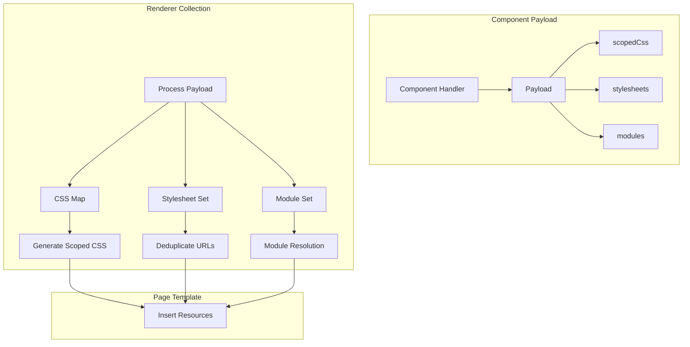
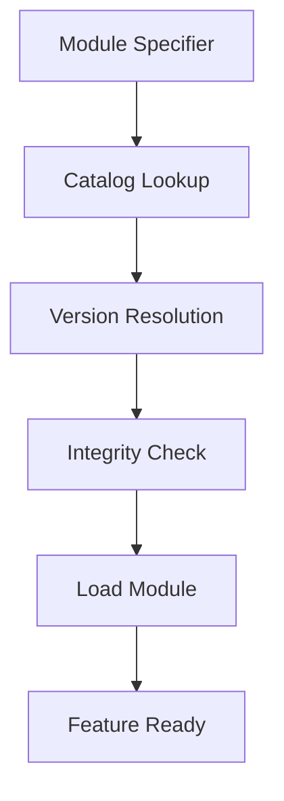

---
**Status:** SUPERSEDED, REQUIRES ATTENTION
**History:**
- 2025-07-29: SUPERSEDED, REQUIRES ATTENTION
- 2025-07-29: ACTIVE
**Scope:** Details the resource management system for the MWI, covering CSS, modules, and other resources.
**Replaces:**
**Replaced by:** [Accurate, up-to-date documentation needs to be created]
**Related:** MWI-Architecture-v3-Core.md, Bundling-Design-Proposal.md
---

# MWI Resource Management

This document details the resource management system for the Mesgjs Web Interface (MWI), focusing on how CSS, modules, and other resources are handled across SSR and CSR contexts.

## Resource Collection



### Collection Process

1. **Resource Accumulation:**
   ```typescript
   class MWIRenderer {
       private scopedCssMap: Map<string, string>;  // component -> css
       private stylesheets: Set<string>;           // unique URLs
       private modules: Set<string>;               // module specifiers
       
       protected processPayload(payload: ComponentPayload, componentName: string) {
           // Store scoped CSS with component name as key
           if (payload.scopedCss) {
               const trimmed = payload.scopedCss.replace(/^\s+/gm, '').trim();
               this.scopedCssMap.set(componentName, trimmed);
           }
           
           // Add stylesheets (deduplication via Set)
           payload.stylesheets?.forEach(sheet => this.stylesheets.add(sheet));
           
           // Add modules (deduplication via Set)
           payload.modules?.forEach(mod => this.modules.add(mod));
       }

       protected trimCodeBlock(code: string): string {
           return code.replace(/^\s+/gm, '').trim();
       }
   }
   ```

2. **Resource Access:**
   ```typescript
   interface RendererResources {
       scopedCss: string;        // Combined, scoped CSS
       stylesheets: string[];    // Unique stylesheet URLs
       modules: string[];        // Unique module specifiers
   }
   ```

## CSS Management

### Scoped CSS

1. **Scope Generation:**
   ```typescript
   class MWIRenderer {
       private scopeCounter: number = 0;
       private scopeIds: Map<string, string> = new Map();
       
       protected getScopeId(componentName: string): string {
           if (!this.scopeIds.has(componentName)) {
               this.scopeIds.set(componentName, `MWI-${this.scopeCounter++}-`);
           }
           return this.scopeIds.get(componentName)!;
       }
   }
   ```

2. **CSS Processing:**
   ```typescript
   class MWIRenderer {
       protected generateScopedCss(): string {
           let css = '';
           for (const [component, rules] of this.scopedCssMap) {
               const scopeId = this.getScopeId(component);
               css += rules.replace(/@@/g, scopeId);
           }
           return css;
       }
   }
   ```

### Example Usage

```typescript
// In component payload
{
    scopedCss: `
        .@@container {
            margin: 1em;
        }
        .@@title {
            color: blue;
        }
    `
}

// After trimming and processing (scopeId = MWI-0-)
.MWI-0-container {
margin: 1em;
}
.MWI-0-title {
color: blue;
}
```

## Module Management

### Module Loading

1. **Security Requirements:**
   - No direct script loading
   - Integrity checking required
   - Catalog-based resolution
   - Permission enforcement

2. **Module Format:**
   ```mesgjs
   [(
       /* SLID-encoded metadata */
       module: "component/path"
       version: "1.0.0"
       features: ["render", "hydrate"]
   )]
   '' @js{
       if (!mid) throw new Error('Required Mesgjs module management is not active');
       
       // Implementation
       $c.fready(mid, 'feature');
   @}
   ```

### Resolution Process



## Resource Security

### URL Sanitization

```typescript
class MWIRenderer {
    private sanitizeUrl(url: string): string | null {
        try {
            const parsed = new URL(url);
            // Only allow https:// or specific trusted domains
            if (parsed.protocol !== 'https:' && 
                !this.isTrustedDomain(parsed.hostname)) {
                return null;
            }
            return url;
        } catch {
            return null;
        }
    }
    
    protected addStylesheet(url: string) {
        const safe = this.sanitizeUrl(url);
        if (safe) {
            this.stylesheets.add(safe);
        }
    }
}
```

### Module Verification

```typescript
interface ModuleMetadata {
    path: string;
    version: string;
    hash: string;    // SHA-512
    features: string[];
}

class ModuleCatalog {
    async resolveModule(specifier: string): Promise<ModuleMetadata | null> {
        const meta = await this.lookup(specifier);
        if (!meta || !this.verifyHash(meta)) {
            return null;
        }
        return meta;
    }
}
```

## Page Template Integration

### Resource Injection

```typescript
class MWIPageTemplate {
    injectResources(resources: RendererResources) {
        // Add scoped CSS (already trimmed during collection)
        if (resources.scopedCss) {
            this.addToHead('style', resources.scopedCss);
        }
        
        // Add stylesheets
        for (const url of resources.stylesheets) {
            this.addToHead('link', '', {
                rel: 'stylesheet',
                href: url
            });
        }
        
        // Add module metadata (trim any multi-line JSON)
        const moduleData = JSON.stringify({
            modules: resources.modules
        }, null, 2).replace(/^\s+/gm, '').trim();
        
        this.addToHead('script', moduleData, {
            type: 'application/json',
            id: 'mwiModules'
        });
    }
}
```

## Resource Activation

### CSR Hydration

```typescript
class MWIHydration {
    async activateResources() {
        // Load module metadata
        const meta = document.getElementById('mwiModules');
        if (!meta) return;
        
        const { modules } = JSON.parse(meta.textContent || '{}');
        
        // Load modules
        for (const spec of modules) {
            await this.loadModule(spec);
        }
    }
}
```

## Error Handling

### Resource Failures

```typescript
class MWIRenderer {
    protected handleResourceError(
        type: 'css' | 'module' | 'stylesheet',
        resource: string,
        error: Error
    ) {
        // Log error
        console.error(`Failed to load ${type}:`, resource, error);
        
        // Emit warning message
        this.emit('warn', {
            code: `resource-${type}-error`,
            resource,
            message: error.message
        });
        
        // Continue rendering if possible
        return null;
    }
}
```

## Future Considerations

1. **Resource Optimization:**
   - CSS bundling and minification
   - Module concatenation
   - Lazy loading
   - Cache management
   - Whitespace optimization

2. **Enhanced Security:**
   - Subresource Integrity (SRI)
   - Content Security Policy (CSP)
   - Resource isolation

3. **Performance:**
   - Resource prioritization
   - Preloading
   - Dependency optimization
   - Output size reduction