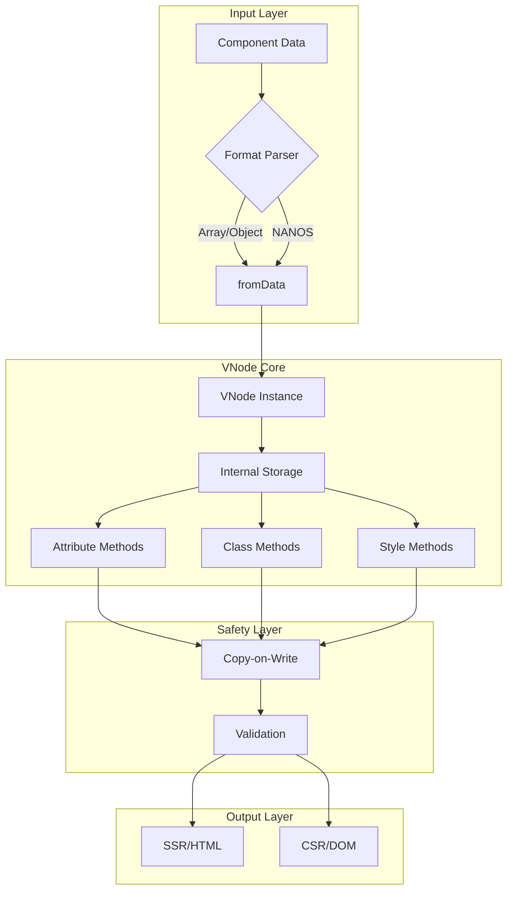

---
**Status:** ACTIVE
**History:**
- 2025-07-29: ACTIVE
**Scope:** Describes the high-level architecture of the MWI VNode system, including the decision to use a purpose-built VNode over a NANOS-centric approach.
**Replaces:**
**Replaced by:**
**Related:** MWI-Architecture-v3-Core.md, MWI-Architecture-v3-VNode-Implementation.md
---
# MWI VNode Architecture

## Architectural Journey

### Initial Approaches Considered

1. **Normalize-to-NANOS Approach** (Initially Proposed)
   - Convert all input to NANOS format
   - Implement explicit copy-on-write
   - Manage mutations through NANOS structures

2. **Purpose-Built VNode** (Original Implementation)
   - HTML-element-like interface
   - Direct attribute manipulation
   - Built-in validation and safety

### Key Decision Points

We initially pursued the normalize-to-NANOS approach, believing it would:
- Provide consistency across SSR and CSR
- Integrate better with Mesgjs
- Simplify data handling

However, this led to several challenges:
- Required explicit declaration of modification intent
- Added complexity in copy management
- Created a less intuitive API for developers
- Introduced unnecessary abstraction layers

### The Pivot Point

Analysis of our existing MWISSRVNode implementation revealed:
1. Already provided a clean, HTML-like interface
2. Successfully handled both Array and NANOS inputs
3. Maintained proper abstraction boundaries
4. Included built-in safety features

This led to the realization that we had overcomplicated the architecture by focusing on NANOS normalization when the VNode abstraction was already providing what we needed.

## Current Architecture



### Core Principles

1. **HTML-Like Interface**
   ```typescript
   class MWIVNode {
       // Attribute access
       setAttr(name: string, value: any): void;
       getAttr(name: string): any;
       
       // Class manipulation
       addClass(name: string): void;
       removeClass(name: string): void;
       
       // Style handling
       setStyle(property: string, value: string): void;
       getStyle(property: string): string;
   }
   ```

2. **Internal Storage with Copy-on-Write**
   ```typescript
   class VNodeStorage {
       #data: Map<string, any>;
       #copied: boolean = false;
       
       modify(): Map<string, any> {
           if (!this.#copied) {
               this.#data = new Map(this.#data);
               this.#copied = true;
           }
           return this.#data;
       }
   }
   ```

3. **Format Handling**
   - NANOS becomes an implementation detail
   - Clean parser interface for different formats
   - Consistent internal representation

### Key Benefits

1. **Developer Experience**
   - Familiar HTML-like API
   - No explicit copy management
   - Clear method names

2. **Safety**
   - Automatic copy-on-write
   - Built-in validation
   - Protected mutations

3. **Performance**
   - Minimal copying overhead
   - Efficient storage
   - Optimized updates

## Implementation Guidelines

### 1. Storage Layer
```typescript
class VNodeStorage {
    #attributes: Map<string, any>;
    #classes: Set<string>;
    #styles: Map<string, string>;
    
    constructor() {
        this.#attributes = new Map();
        this.#classes = new Set();
        this.#styles = new Map();
    }
    
    // Copy-on-write implementation
    protected ensureMutable(): void {
        if (!this.isMutable) {
            this.#attributes = new Map(this.#attributes);
            this.#classes = new Set(this.#classes);
            this.#styles = new Map(this.#styles);
        }
    }
}
```

### 2. VNode Interface
```typescript
class MWIVNode {
    #storage: VNodeStorage;
    
    // Clean, consistent methods
    setAttr(name: string, value: any): void {
        this.#storage.ensureMutable();
        this.#storage.setAttr(name, value);
    }
    
    // Format conversion
    static fromData(data: any): MWIVNode {
        // Handle both Array and NANOS formats
        return new MWIVNode(parseInput(data));
    }
}
```

### 3. Safety Features
- Validation of attribute names and values
- Automatic escaping for HTML output
- Protected internal state

## Lessons Learned

1. **Simplicity Wins**
   - The simpler HTML-like API proved more maintainable
   - Fewer abstraction layers reduced complexity
   - Familiar patterns aid adoption

2. **Implementation Details vs. API**
   - NANOS works better as an implementation detail
   - Clean APIs should hide internal complexity
   - Format conversion belongs in parsers

3. **Evolution Over Revolution**
   - Existing implementations may have hidden wisdom
   - Analyze before replacing
   - Enhance rather than rewrite

4. **API Design**
   - Method names should balance clarity and brevity
   - Consistency in naming patterns
   - Intuitive without being verbose

## Future Considerations

1. **Performance Optimization**
   - Profile copy-on-write behavior
   - Optimize storage structures
   - Consider pooling for frequent operations

2. **Enhanced Features**
   - Event handling integration
   - Animation support
   - Advanced selector support

3. **Developer Tools**
   - Debugging helpers
   - Performance monitoring
   - Migration utilities