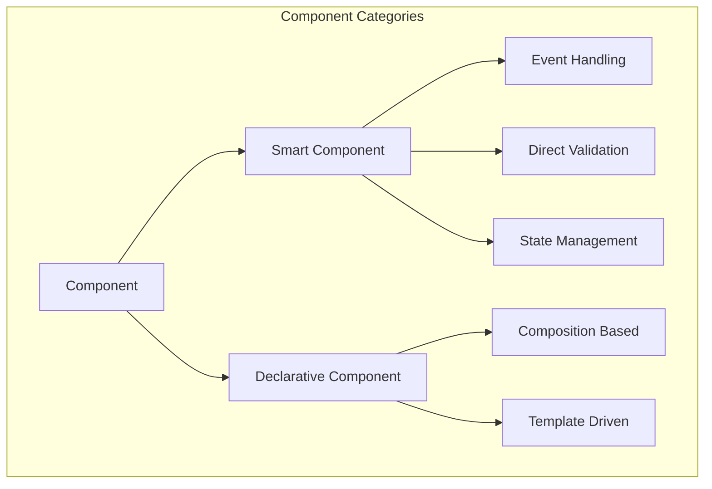

---
**Status:** ACTIVE
**History:**
- 2025-07-29: ACTIVE
**Scope:** Specifies the definitive architecture for the MWI component system, including its lifecycle, types, and state management.
**Replaces:**
**Replaced by:**
**Related:** MWI-Component-Tutorial.md, MWI-Architecture-v3-Core.md
---
# MWI Component System Architecture

This document specifies the definitive architecture for the MWI component system. It is designed to be modular, secure, and tightly integrated with the Mesgjs module-loading ecosystem, using a multi-stage feature-promise handshake for initialization.

## 1. Guiding Principles

-   **Security First:** Component capabilities are defined by trusted modules, and feature readiness is signaled using a unique, runtime-provided module ID (`mid`).
-   **Build-Time Resolution:** Component availability and versioning are resolved at build time by the `msjsload-cli` tool.
-   **Asynchronous, Race-Free Initialization:** The system uses the Mesgjs feature-promise mechanism (`$c.fwait`/`$c.fready`) to orchestrate a safe, non-blocking startup sequence.
-   **SSR/CSR Parity:** The client hydrates using the exact module metadata and initialization sequence as the server.

## 2. Component Types

There are two primary categories of components in the MWI system.



### 2.1. Smart Components
Smart components have full programmatic control over their lifecycle, state, and rendering.
- Full lifecycle control (`mount`, `unmount`)
- Direct event handling via the VNode interface
- Reactive state management
- Fine-grained dependency tracking
- Shadow DOM support
- Direct DOM updates via eager reactives

### 2.2. Declarative Components
Declarative components are simpler, often template-based, and focus on composition.
- Template-based rendering
- Composition with smart components
- Static structure
- Resource declarations (CSS, JS)
- Reactive value consumption
- Automatic dependency tracking

## 3. Build & Runtime Lifecycle

The architecture is centered around a multi-stage handshake that ensures all dependencies are met before rendering begins.

### 3.1. Build Process & Feature Signaling
The MWI application is built by `msjsload-cli`. Modules providing components must declare a **unique** feature promise in their catalog entry's `featpro` field.

-   **Convention:** `mwi.components.<unique.moduleName>`
-   **Example:** The `mwi-html-core` module declares `featpro: "mwi.components.mwi.html.core"`.

### 3.2. The `loadMsjs(mid)` Contract
Every Mesgjs module, when loaded by the runtime, has its exported `loadMsjs` function called with a unique `mid` (module ID). This `mid` is the authorization token required to signal readiness for features declared in that module's metadata.

### 3.3. Runtime Initialization Handshake
The system uses a four-stage, promise-based handshake to initialize correctly.

**Stage 1: Registry Becomes Ready**
The core "registry" module instantiates the `MWIComponentRegistry` and immediately signals that the registry is ready to accept components:
`$c.fready(mid, 'mwi.registry.ready');`

**Stage 2: Component Modules Register Themselves**
The `loadMsjs(mid)` function in each component module:
1.  Calls `$c.fwait('mwi.registry.ready')`.
2.  In the `.then()` block, registers its component definitions.
3.  Signals its own completion: `$c.fready(mid, 'mwi.components.<unique-module-name>');`

**Stage 3: Component System Becomes Ready**
The `MWIComponentRegistry` module:
1.  Scans module metadata for all expected component feature names.
2.  Calls `$c.fwait()` with the complete list of feature names.
3.  When the `fwait` resolves, it signals that the entire component system is ready: `$c.fready(registryMid, 'mwi.components.ready');`

**Stage 4: Application Renders**
The main MWI application logic is wrapped in a final startup call, ensuring rendering only begins after the component system is fully initialized:
`$c.fwait('mwi.components.ready').then(() => { /* ... start rendering ... */ });`

### 3.4. Mount/Unmount Monitor (MUM)
The `MWIMUM` is responsible for dispatching `mount` and `unmount` lifecycle events to components based on their corresponding element's presence in the DOM. It uses a `MutationObserver` to efficiently track changes. Handlers subscribe by element ID. On unmount, event listeners are automatically cleaned up to prevent memory leaks.

## 4. Component Handler and State

### 4.1. Handler Structure and Payload
Component handlers are the core logic for a component. They must define a `render` function and can optionally include lifecycle hooks. The `render` function returns a payload describing the component's output.

```typescript
interface ComponentPayload {
    content: any; // NANOS or Array structure
    scopedCss?: string;
    stylesheets?: Set<string>;
    modules?: Set<string>;
    
    // Declarative mount/unmount subscriptions
    mount?: { [elementId: string]: ... };
    unmount?: { [elementId: string]: ... };

    // Reactive bindings for the VNode
    reactiveBindings?: { [key: string]: Reactive };
}
```

### 4.2. Reactive State Management
Smart components have access to a built-in reactive state system.

- **`defineState(key, options)`:** Creates a reactive value with automatic dependency tracking.
- **`getState(key)`:** Retrieves a reactive value.
- **`.rv` / `.wv`:** Provides safe read-only and write-only access to reactive values.
- **`batchUpdate(callback)`:** Groups multiple state changes to prevent unnecessary re-renders.
- **Computed Values:** State can be derived from other state, automatically updating when dependencies change.

## 5. Data Handling and Best Practices

### 5.1. Input Data Normalization
- Components can receive input as NANOS (preferred) or a standard JavaScript Array.
- The system automatically converts Array inputs into a new NANOS structure.
- **Immutability is guaranteed by the VNode's copy-on-write strategy.** Components do not need to make their own copies of input data.

### 5.2. Best Practices
1.  **Prefer NANOS:** Use the NANOS format for component data structures to leverage its rich API.
2.  **Trust the VNode:** Rely on the VNode's copy-on-write mechanism for data immutability.
3.  **Direct Attribute Access:** Access and modify attributes directly on the NANOS object. Empty attribute objects (`{}`) are not required.