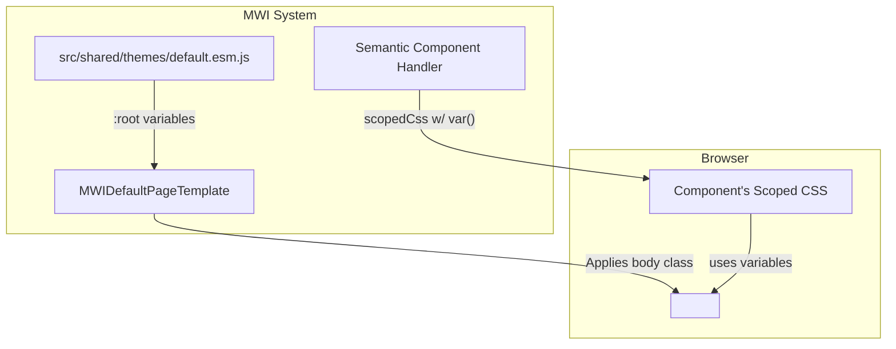
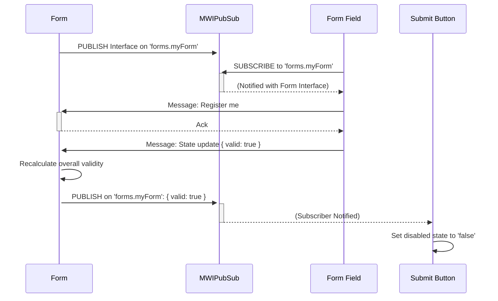

# MWI Semantic Component Architecture

This document outlines the architecture for the MWI's foundational semantic component library. It builds upon the initial requirements and integrates with the core MWI framework, including theming, state management, and rendering pipelines.

## 1. Component Structure and File Organization

To maintain a clean separation of concerns and facilitate modular loading, semantic components will be organized into their own directory and module catalog.

**Proposed Directory Structure:**
```
src/
└── shared/
    └── components/
        ├── mwi-html-core.esm.js         # (existing primitive components)
        └── mwi-semantic-core/           # (new)
            ├── button.esm.js
            ├── text-input.esm.js
            ├── form.esm.js
            ├── index.esm.js             # Exports all semantic components
            └── mwi-semantic-core.msjcat # Module catalog for the semantic library
```

This structure isolates the semantic library, allowing it to be managed and versioned independently from the primitive `h.*` components.

## 2. Theming and Styling Architecture

Theming will be handled via CSS custom properties (variables) to support the requirements for light/dark modes and configurable colors. This approach leverages the existing `scopedCss` mechanism for component encapsulation.

*   **Central Theme Definition:** A global theme module will define theme variables on the `:root` element. This file will contain definitions for both light and dark themes, toggled by a class on a container element (e.g., `<body>`).
*   **Dynamic Theme Application:** The `MWIDefaultPageTemplate` will be responsible for applying the current theme by adding a class (e.g., `theme-light` or `theme-dark`) to the `<body>` tag based on configuration.
*   **Component Consumption:** Semantic components will use these CSS variables (`var(--mwi-primary-color)`) within their `scopedCss` payloads. This allows components to adapt to the current theme without containing any theme-specific logic themselves.



## 3. State Management and Form Communication (Pub/Sub)

To ensure robust and scalable communication, the `form` component will act as a central hub, and its `fields` will act as clients. This is achieved through the MWI Pub/Sub system, with the final implementation target being a Mesgjs interface.

*   **Discovery and Registration:**
    1.  The `form` component, on mount, publishes its own messaging interface to a well-known channel (e.g., `forms.<form-name>`).
    2.  Each `field` component (e.g., `text-input`) subscribes to this channel to discover the form's interface.
    3.  Upon discovery, the field sends a registration message to the form.
*   **State Communication:**
    1.  Once registered, the field sends messages with its state (e.g., `{ value: '...', valid: true }`) directly to the form's interface. It does not publish this to a general channel.
    2.  The `form` component tracks the state of all its registered fields.
    3.  The `form` then publishes its own aggregate state (e.g., `{ valid: false }`) to its channel, which other components (like a submit button) can subscribe to.

This "form-first" approach is more aligned with a parent-child component hierarchy and provides a clearer data flow.



### Mesgjs Interface Requirement

While an initial implementation may use JavaScript-based Pub/Sub for rapid prototyping, the definitive, primary interface for form communication **must** be a Mesgjs interface. This ensures the communication adheres to the security and structural guarantees of the MWI ecosystem. JS-only implementations should be considered temporary shims.

## 4. Validation Mechanism

The `v.*` validation attributes provide a declarative interface for input validation.

1.  A component handler (e.g., for `text-input`) will parse attributes like `v.min`, `v.len`, `v.ire`, and `v.are`.
2.  It will instantiate corresponding reactive validators that take the field's value as input.
3.  The collective state of these validators determines the field's overall `valid` property, which is then published via the Pub/Sub system.

## 5. Bidirectional Data Binding (`m.bind`)

The `m.bind` attribute is the declarative syntax for creating a two-way binding between a component and a shared `@reactive` data source.

1.  **Read (Source -> Input):** The component handler interprets `m.bind="path.to.data"` as a subscription request. It subscribes to the reactive value at that path. When the source data changes, the component's internal value is updated.
2.  **Write (Input -> Source):** The handler also establishes a publisher. When the user modifies the input and the change is committed (e.g., on a `blur` event), the new value is written back to the reactive data source at `path.to.data`.

### Handling Concurrent Edits

To address the requirement that programmatic changes are deferred while a user is actively editing a field:
- The component will maintain two internal states: a "live value" (from user input) and a "pending value" (from the `m.bind` subscription).
- If the `m.bind` subscription fires while the user is editing, the new value is stored as the "pending value" but not rendered in the input.
- If the user commits their changes, the "live value" is written to the source, overwriting the "pending value".
- If the user presses `Escape`, the "live value" is discarded, and the "pending value" is applied to the input, reverting the field to the latest programmatic state.

## 6. Button-to-Link Transformation

The semantic `button` component will support rendering as either a `<button>` or an `<a>` tag based on the presence of an `href` attribute.

1.  The button component handler will inspect its input data for an `href` attribute.
2.  **If `href` exists:** The handler will return a `MWIVNode` for an `<a>` tag. It will pass through the `href` and other relevant attributes (`target`, `rel`, etc.) and apply CSS classes to make the link visually identical to a button.
3.  **If `href` does not exist:** The handler will return a `MWIVNode` for a `<button>` element.

This allows for semantic flexibility while maintaining a consistent visual language.