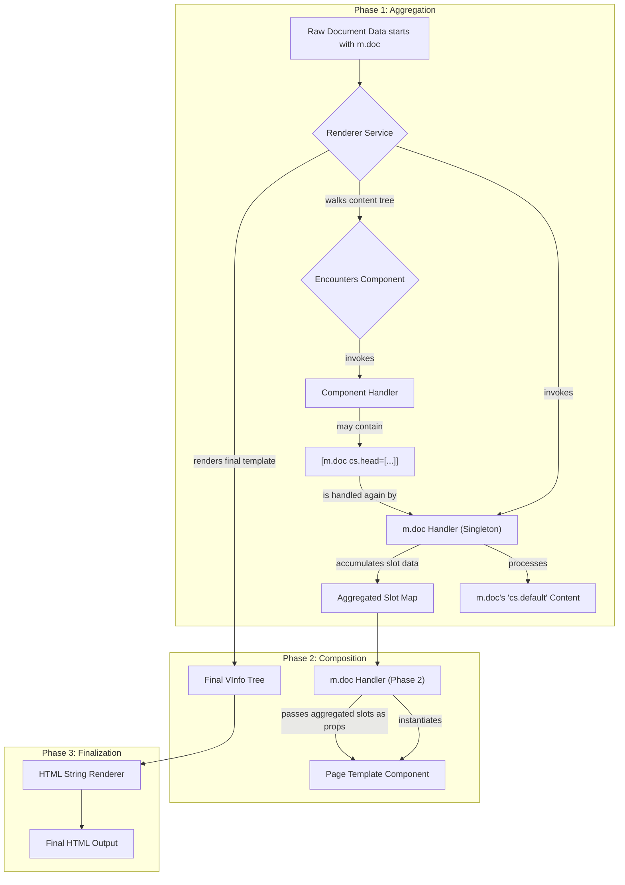

---
**Status:** DRAFT
**History:**
- 2025-08-03: DRAFT
**Scope:** The core system architecture for the Mesgjs Web Interface (MWI) v4, replacing the v3 payload-based model with a simpler, two-phase, document-centric rendering pipeline.
**Replaces:** `MWI-Architecture-v3-Core.md`, `MWI-Architecture-v3-VNode.md`, `MWI-Architecture-v3-VNode-Implementation.md`, `MWI-Slot-System.md`
**Replaced by:**
**Related:** `MWI-Component-System.md`
---
# MWI System Architecture v4

## 1. Executive Summary

MWI v4 represents a significant evolution of the rendering architecture, designed to address the complexity and ambiguity of the v3 model. It replaces the single-pass, payload-driven renderer with a cleaner, two-phase, "inside-out" process orchestrated by a new `m.doc` primitive.

This new architecture retains the most powerful features of v3—a unified component model, sophisticated content slotting, and multi-plane rendering—while implementing them in a more robust, predictable, and decoupled way. The primary goal is to increase developer velocity, simplify debugging, and provide a more resilient foundation for future development.

## 2. Core Concepts

The v4 architecture is built on a small set of cooperative components and services that separate rendering concerns into logical stages.

*   **Document-Centric Rendering:** The entire render process is driven by a single, top-level `[m.doc]` component. This component orchestrates a two-phase render.
*   **Two-Phase "Inside-Out" Flow:**
    1.  **Phase 1 (Aggregation):** The main body of the document is processed first. During this phase, content for other parts of the page (e.g., `<head>` resources, modals) is sent "upward" and aggregated.
    2.  **Phase 2 (Composition):** Once aggregation is complete, a final page template is rendered, and the aggregated content is slotted "downward" into the final structure.
*   **A Simplified `Renderer` Service:** The renderer's role is simplified. It is responsible for walking data structures and invoking component handlers, but the complex orchestration logic is moved into the `m.doc` handler itself.
*   **`VInfo` Data Objects:** The complex `MWIVNode` class is replaced by `VInfo`, a simple, immutable, plain data object representing a node. This object contains no methods; it is pure data.
*   **Unified Slotting:** Both "downward" (parent-to-child) and "upward" (child-to-document) content projection are handled by the same, consistent `cs.*` (content slot) and `as.*` (attribute slot) convention.

## 3. The Rendering Pipeline



### 3.1. Phase 1: Content Render & Aggregation

1.  The user provides a single, top-level data structure beginning with `[m.doc template=MyTemplate ...]`.
2.  The `Renderer` service begins processing. It recognizes `m.doc` and invokes its handler, establishing it as the singleton aggregator for this render cycle.
3.  The `m.doc` handler instructs the `Renderer` to process its main content (everything after its named attributes, which is implicitly the `cs.default` slot).
4.  As the `Renderer` walks this content tree, it may encounter other `m.doc` declarations (e.g., `[m.doc cs.head=[...]]`). Because an aggregator is already active, these subsequent calls are routed to the *same singleton handler*.
5.  The handler sees the new slot data and **accumulates** it. `cs.head` content is appended to a list of head content. `as.body` attributes are merged with any previously seen body attributes.
6.  This process continues until the entire main content tree has been processed. At this point, the `m.doc` handler holds a complete map of all aggregated content intended for the final page template.

### 3.2. Phase 2: Template Instantiation & Final Render

1.  Execution returns to the original `m.doc` handler, which now proceeds to its second phase.
2.  It retrieves the final page template component type from its `template` attribute (e.g., `MyPageTemplateType`).
3.  It instructs the `Renderer` to process this template component, passing the entire `aggregatedSlots` map as the component's properties.
4.  The page template component is just a standard declarative component. It uses `[m.slot name=cs.head]`, `[m.slot name=cs.body]`, etc., to render the content it received in its properties.
5.  The `Renderer` processes this final component tree, which now contains all the aggregated content in the correct places. The result is a complete `VInfo` tree of only primitive `h.*` elements.
6.  This final, primitive tree is passed to a simple stringifier to produce the final HTML output.

## 4. Key Primitives & APIs

### 4.1. `[m.doc]` Component

This is the orchestrator.

*   **Syntax:** `[m.doc template=<component-name> ...document-content...]`
*   All content after the named attributes is part of its `cs.default` slot.
*   Nested `[m.doc cs.foo=[...]]` or `[m.doc as.bar=[...]]` calls are used for upward slotting.
*   The handler manages the two-phase rendering process.

### 4.2. `VInfo` Data Structure

A plain, immutable data object representing a node. It replaces the `MWIVNode` class.

```typescript
interface VInfo {
    readonly type: string; // e.g., 'div', 'my-component', '#text'
    readonly attrs: { [key: string]: any };
    readonly children: VInfo[];
    readonly text?: string; // for #text nodes
}
```

### 4.3. Renderer Service API

A simplified service with two primary methods.

```typescript
class Renderer {
    // Top-level entry point
    render(docData: any): string;

    // Recursive processor for use by component handlers
    process(data: any): VInfo;

    // The context for the current render cycle
    readonly context: RenderContext;
}
```

## 5. Architectural Benefits

This Document-Centric model provides numerous advantages over v3:

*   **Conceptual Simplicity:** Replaces the complex payload system with a more intuitive two-phase "inside-out" flow.
*   **Unified Slotting:** `cs.*` and `as.*` conventions are used for all content projection, eliminating the need for separate mechanisms.
*   **Decoupling:** `VInfo` objects are pure data, separating data from behavior. The `Renderer`'s responsibilities are simplified.
*   **Predictability:** The flow of data is explicit and functional, making it easier to trace, debug, and test.
*   **Flexibility:** Page templates are just standard components, and the "upward slotting" mechanism is fully dynamic, not tied to a hard-coded list of planes.