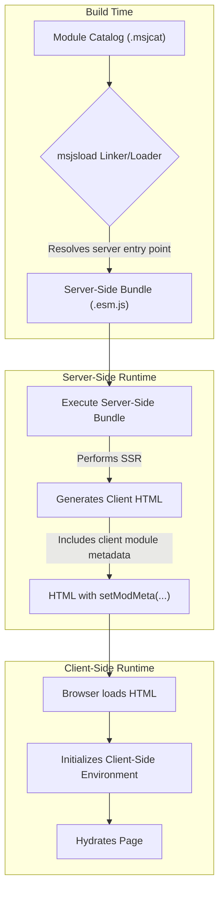

# MWI Component Architecture (Final)

This document specifies the definitive architecture for the MWI component system. It is designed to be modular, secure, and tightly integrated with the Mesgjs module-loading ecosystem, using a multi-stage feature-promise handshake for initialization.

## Guiding Principles

-   **Security First:** Component capabilities are defined by trusted modules, and feature readiness is signaled using a unique, runtime-provided module ID (`mid`).
-   **Build-Time Resolution:** Component availability and versioning are resolved at build time by the `msjsload-cli` tool.
-   **Asynchronous, Race-Free Initialization:** The system uses the Mesgjs feature-promise mechanism (`$c.fwait`/`$c.fready`) to orchestrate a safe, non-blocking startup sequence.
-   **SSR/CSR Parity:** The client hydrates using the exact module metadata and initialization sequence as the server.

## Build & Runtime Lifecycle

The architecture is centered around a multi-stage handshake that ensures all dependencies are met before rendering begins.

### Dual-Resolution Build and Render Process
The MWI's hybrid nature is enabled by a build and render process that leverages the `msjsload` linker/loader's dual entry-point mode. This allows for two separate dependency resolutions from a single module catalog: one for the server-side rendering (SSR) environment and one for the client-side rendering (CSR) environment.

The process unfolds as follows:

The `msjsload-cli` tool produces a single JavaScript bundle for the server. This server-side bundle contains all the necessary logic to render a page. When executed, the server-side code performs its rendering tasks and, if the page is interactive, generates the necessary HTML and client-side module metadata for the browser. This client-side metadata is derived from the `client` top-level key of the server's own module metadata, ensuring the client has the correct information for hydration.

### 1. Build Process & Feature Signaling
The MWI application is built by `msjsload-cli`. Modules providing components must declare a **unique** feature promise in their catalog entry's `featpro` field.

-   **Convention:** `mwi.components.<unique.moduleName>`
-   **Example:** The `mwi-html-core` module declares `featpro: "mwi.components.mwi.html.core"`.

### 2. The `loadMsjs(mid)` Contract
Every Mesgjs module, when loaded by the runtime, has its exported `loadMsjs` function called with a unique `mid` (module ID). This `mid` is the authorization token required to signal readiness for features declared in that module's metadata.

### 3. Runtime Initialization Handshake
The system uses a four-stage, promise-based handshake to initialize correctly.

#### Stage 1: Registry Becomes Ready
The MWI application has a core "registry" module. When its `loadMsjs(mid)` function is called, it instantiates the `MWIComponentRegistry` and immediately signals that the registry is ready to accept components:
`$c.fready(mid, 'mwi.registry.ready');`

#### Stage 2: Component Modules Register Themselves
The `loadMsjs(mid)` function in each component module performs the following actions:
1.  It calls `$c.fwait('mwi.registry.ready')`.
2.  In the `.then()` block of the returned promise, it calls a function to push its component definitions into the now-available registry.
3.  Finally, it signals its own completion using its unique `mid`: `$c.fready(mid, 'mwi.components.<unique-module-name>');`

#### Stage 3: Component System Becomes Ready
After signaling its own readiness in Stage 1, the `MWIComponentRegistry` module proceeds to its next task:
1.  It scans the runtime module metadata to get a list of all expected component feature names (i.e., all `featpro` strings starting with `mwi.components.`).
2.  It calls `$c.fwait()` with this complete list of feature names.
3.  When this second `fwait` promise resolves, it calls `$c.fready()` with its own `mid` to signal that the entire component system is ready: `$c.fready(registryMid, 'mwi.components.ready');`

#### Stage 4: Application Renders
The main MWI application logic is wrapped in a single, final startup call: `$c.fwait('mwi.components.ready').then(() => { /* ... start rendering ... */ });`. This ensures that rendering only begins after the entire component system has been safely and fully initialized.

### 4. Client-Side Hydration
The client application follows the exact same four-stage handshake, guaranteeing perfect SSR/CSR parity.