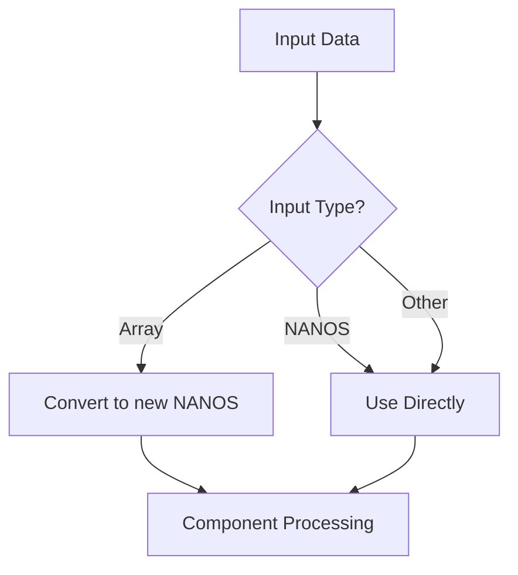

# MWI Component Development Guidelines

## Data Format and Handling

### Input Format Handling

Components receive input in one of two primary formats:
1. NANOS format (primary/preferred)
2. Array format (automatically converted to NANOS)

The system handles input normalization following these rules:



#### Input Processing Rules

```javascript
if (Array.isArray(content)) {
    // Array input: Creates new NANOS automatically
    content = new NANOS(...content.map(v => ...));
}
// All NANOS and other inputs are used directly.
// Immutability is guaranteed by the VNode's copy-on-write strategy.
```

### Smart Component Behavior

Smart components:
- Receive a new NANOS if the original input was an Array.
- Can operate on their input data with the assurance that the rendering pipeline's VNode layer will handle data immutability via its copy-on-write strategy. There is no need for the component to make its own copy.
- Can add/remove classes, modify styles, etc.
- May return a `content` payload containing a modified or new data structure to be rendered into its slot.

### Attribute Handling

- Direct attribute specification is preferred
- No empty attribute objects needed
- Use direct NANOS property access
- Class and style modifications:
  ```javascript
  // Adding classes
  content.set('class', 'new-class additional-class');
  
  // Modifying styles
  content.set('style', 'color: blue; font-size: 16px;');
  ```

## Best Practices

1. **Use NANOS Format**
   - Prefer NANOS format for component input
   - Leverage NANOS methods for property access
   - Take advantage of built-in normalization

2. **Smart Component Design**
   - Trust the VNode's copy-on-write mechanism to handle data immutability.
   - Use in-place modifications when appropriate
   - Document any persistent state

3. **Attribute Handling**
   - Access attributes directly through NANOS
   - No need for empty attribute objects
   - Use standard patterns for class/style modifications