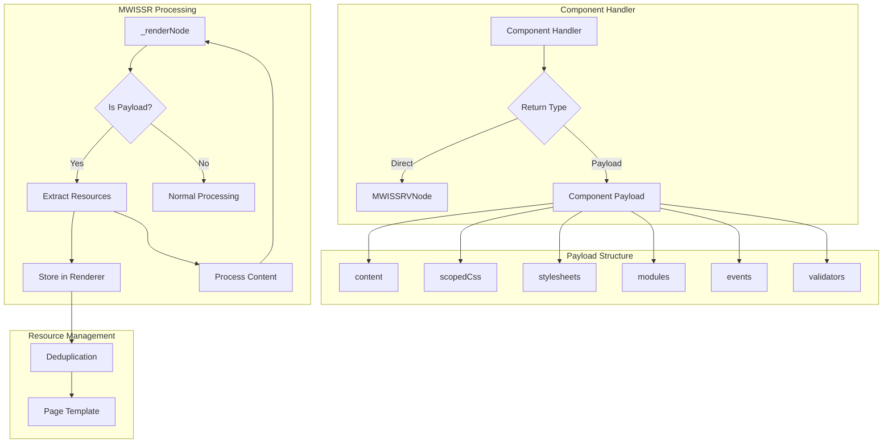

# Payload Support Architecture for MWI SSR

## Overview

This document outlines the architecture for reintegrating payload support into the SSR implementation, allowing components to provide resources like scoped CSS, external stylesheets, and event handlers while maintaining the single-pass rendering model.



## 1. Component Payload Interface

Component handlers can return either:
- A direct `MWISSRVNode` (current behavior)
- A Component Payload object with the following structure:

```typescript
interface ComponentPayload {
    // Required: The actual content to render (Array/NANOS/MWISSRVNode)
    content: any;
    
    // Optional: Component-specific scoped CSS
    scopedCss?: string;
    
    // Optional: External stylesheet URLs to include
    stylesheets?: Set<string>;
    
    // Optional: Mesgjs module specifiers to load
    modules?: Set<string>;
    
    // Optional: Event handler registrations
    events?: {
        [interfaceName: string]: {
            [handlerName: string]: string[]  // Event names
        }
    };
    
    // Optional: Validator registrations
    validators?: {
        [interfaceName: string]: {
            [handlerName: string]: string[]  // Field names
        }
    };
}
```

## 2. MWISSR Changes

### 2.1. Resource Collection
Add resource collection to the MWISSR class:

```typescript
class MWISSR {
    private scopedCssMap: Map<string, string>;  // componentName -> scopedCss
    private stylesheets: Set<string>;
    private modules: Set<string>;
    private events: Map<string, Set<string>>;  // interfaceName -> Set<handlerName>
    private validators: Map<string, Set<string>>;  // interfaceName -> Set<handlerName>
    
    constructor() {
        // Initialize collections
    }
}
```

### 2.2. Modify _renderNode

```typescript
_renderNode(data: any): MWISSRVNode {
    // Handle primitives and existing VNodes as before
    if (isPrimitive(data) || data instanceof MWISSRVNode) {
        return data;
    }

    // Create VNode from component data
    const vnode = MWISSRVNode.fromData(data);
    
    // Get component handler
    const handler = this.componentFactory.get(vnode.type);
    
    if (!handler) {
        return this.renderChildren(vnode);
    }
    
    // Execute handler
    const result = handler(vnode, this);
    
    // Check if result is a payload
    if (isPayload(result)) {
        // Extract and store resources
        this.processPayload(result, vnode.type);
        
        // Continue rendering with the content
        return this._renderNode(result.content);
    }
    
    // Normal processing for direct VNode returns
    return this._renderNode(result);
}
```

### 2.3. Add Payload Processing

```typescript
private processPayload(payload: ComponentPayload, componentName: string) {
    // Store scoped CSS with component name as key
    if (payload.scopedCss) {
        this.scopedCssMap.set(componentName, payload.scopedCss);
    }
    
    // Add stylesheets
    if (payload.stylesheets) {
        for (const sheet of payload.stylesheets) {
            this.stylesheets.add(sheet);
        }
    }
    
    // Add modules
    if (payload.modules) {
        for (const mod of payload.modules) {
            this.modules.add(mod);
        }
    }
    
    // Register events
    if (payload.events) {
        for (const [iface, handlers] of Object.entries(payload.events)) {
            if (!this.events.has(iface)) {
                this.events.set(iface, new Set());
            }
            for (const [handler, events] of Object.entries(handlers)) {
                this.events.get(iface)!.add(handler);
            }
        }
    }
    
    // Register validators
    if (payload.validators) {
        for (const [iface, handlers] of Object.entries(payload.validators)) {
            if (!this.validators.has(iface)) {
                this.validators.set(iface, new Set());
            }
            for (const [handler, fields] of Object.entries(handlers)) {
                this.validators.get(iface)!.add(handler);
            }
        }
    }
}
```

### 2.4. Scope ID Generation

```typescript
private getScopeId(componentName: string): string {
    if (!this.scopeIds.has(componentName)) {
        this.scopeIds.set(componentName, `mwi-${this.scopeCounter++}`);
    }
    return this.scopeIds.get(componentName)!;
}
```

## 3. Page Template Integration

The MWISSR will provide methods to access the collected resources:

```typescript
class MWISSR {
    // ... other methods ...
    
    getResources() {
        return {
            scopedCss: this.generateScopedCss(),
            stylesheets: Array.from(this.stylesheets),
            modules: Array.from(this.modules),
            events: this.serializeEventMap(this.events),
            validators: this.serializeEventMap(this.validators)
        };
    }
    
    private generateScopedCss(): string {
        let css = '';
        for (const [component, rules] of this.scopedCssMap) {
            const scopeId = this.getScopeId(component);
            css += rules.replace(/@@/g, scopeId);
        }
        return css;
    }
}
```

## 4. Security Considerations

1. The renderer will sanitize all URLs for stylesheets
2. Module specifiers must match the allowed pattern for Mesgjs modules
3. No direct script injection is allowed through the payload system
4. Event and validator handlers must be registered through the proper Mesgjs module system

## 5. Implementation Plan

1. Add resource collection properties to MWISSR
2. Implement payload detection and processing in _renderNode
3. Add resource management methods
4. Update MWIDefaultPageTemplate to handle the new resource types
5. Add security checks and sanitization
6. Update component handlers to use the new payload system
7. Add tests for payload processing and resource collection