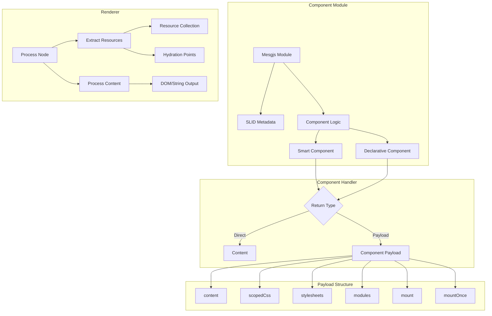
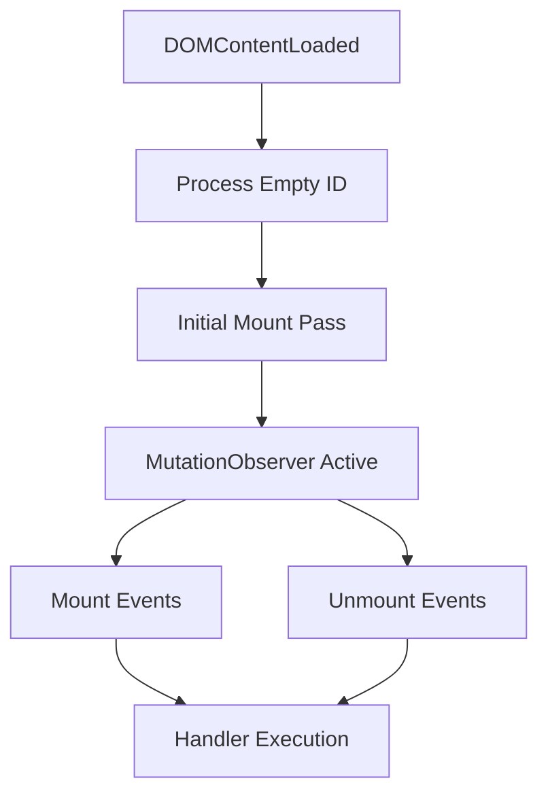

---
**Status:** SUPERSEDED
**History:**
- 2025-08-04: SUPERSEDED
- 2025-07-29: ACTIVE
**Scope:** The core system architecture for the Mesgjs Web Interface (MWI), covering rendering, components, hydration, and security.
**Replaces:**
**Replaced by:** `MWI-V4-Core-Architecture.md`
**Related:** MWI-Architecture-v3-VNode.md, MWI-Architecture-v3-Hydration.md, MWI-Architecture-v3-Reactive.md, MWI-Architecture-v3-Resources.md
---
# MWI System Architecture v3

The Mesgjs Web Interface (MWI) is a bilingual JavaScript-and-Mesgjs system for rendering web interfaces from structured data, supporting both server-side (SSR) and client-side (CSR) rendering through a unified payload-based architecture.

## Core Architecture



## Component Payloads

Component handlers can return either direct content or a payload object that bundles content with its associated resources:

```typescript
interface ComponentPayload {
    // Required: The actual content to render
    content: any;
    
    // Optional: Component-specific scoped CSS
    scopedCss?: string;
    
    // Optional: External stylesheet URLs to include
    stylesheets?: Set<string>;
    
    // Optional: Mesgjs module specifiers to load
    modules?: Set<string>;

    // Optional: Mount handlers (hydration)
    mount?: {
        [elementId: string]: Array<{
            module: string;      // Hydration module specifier
            interface: string;   // Interface name
            message: any;        // Initialization data
        }>;
    };

    // Optional: One-time mount handlers
    mountOnce?: {
        [elementId: string]: Array<{
            module: string;
            interface: string;
            message: any;
        }>;
    };
}
```

Key aspects:
- Resources are accumulated and deduplicated in the renderer
- Scoped CSS uses `MWI-{counter}-` prefix
- Stylesheets and modules are uniquely collected
- Content can be processed recursively
- Mount handlers are registered through component factory

## Module System

### Component Module Format
```mesgjs
[(
    /* SLID-encoded metadata */
    /* module path, version, features */
)]
'' @js{
    if (!mid) throw new Error('Required Mesgjs module management is not active');
    
    // Component implementation
    const interface = $c.getInterface('componentName');
    interface.set({ /* implementation */ });
    
    // Feature readiness
    $c.fready(mid, 'interface-or-feature');
@}
```

Key aspects:
- SLID-encoded metadata for module management
- Strict security: No direct script loading
- Feature-based readiness signaling
- Interface-based component registration

## Component Types

### Smart Components
- Full event handling capabilities
- Direct validation support
- Can return payloads with resources
- Shadow DOM support for private fields

### Declarative Components
- Composition-based architecture
- Template-driven rendering
- Can return payloads with resources
- Uses smart components for interaction

## Hydration Architecture

### Element Identification
- SSR generates "MWS$" + counter IDs
- CSR generates "MWC$" + counter IDs
- Supports placeholder replacement
- Maintains ID consistency across renders

### Mount/Unmount Monitor (MUM)


Features:
- Activates on DOMContentLoaded
- Empty ID ('') handlers run first
- Processes initial mount/mountOnce
- Observes DOM mutations
- Manages subscription lifecycle

### Mount Points
1. Global (Empty ID):
   - Runs first at DOMContentLoaded
   - Handles head content
   - Global state initialization
   - Non-element-specific setup

2. Element-specific:
   - Keyed by element ID
   - Supports mount/mountOnce
   - Handles component hydration
   - Allows placeholder replacement

### Subscription Management
- Unique Symbol IDs for cancellation
- Support for static data from SSR
- JS callback functions in CSR
- Mesgjs callback functions
- Optional 'once' flag

## Resource Management

### CSS Handling
- Component-level scoped CSS via payloads
- Automatic scope ID generation
- Style deduplication in renderer
- External stylesheet collection

### Module Loading
- Catalog-based module resolution
- Integrity verification
- No direct script execution
- Dependency management

## Data Management

### Reactive Binding
```mesgjs
[input d.value=some.binding.path]
```
- Two-way data binding
- Path-based binding syntax
- Reactive updates
- Change tracking

### Form Validation
- Field-level validation
- Pattern matching
- Length constraints
- Required field handling
- Incremental validation

### Internationalization
```mesgjs
[component m.i18n=i18n.key.path]
```
- Key-based translations
- Sub-path support
- Dynamic language switching
- Fallback handling

## Security Model

### Module Loading
- Catalog-based module resolution
- Integrity verification
- No direct script execution
- Sandboxed evaluation

### DOM Protection
- Shadow DOM for private fields
- Scoped styles via payloads
- Sanitized data binding
- Controlled event dispatch

## Implementation Classes

### Core Classes
- MWISSR/MWICSR: Main renderer implementations
- MWISSRFactory/MWICSRFactory: Component factories
- MWIMUM: Mount/unmount monitor

### Component Support
- Single-file component support
- Payload-based resource management
- SSR/CSR compatibility
- Resource collection in renderer

## Error Handling

### Validation
- Field-level errors
- Form-level validation
- Pattern matching
- Required fields

### Runtime
- Module loading errors
- Hydration failures
- Resource loading issues
- Payload processing errors

## Future Considerations

1. Performance Optimization:
   - Resource bundling
   - Lazy hydration
   - Payload caching

2. Enhanced Security:
   - Extended Shadow DOM usage
   - Fine-grained permissions
   - Resource isolation

3. Form Enhancements:
   - Advanced validation
   - Custom field types
   - Layout systems