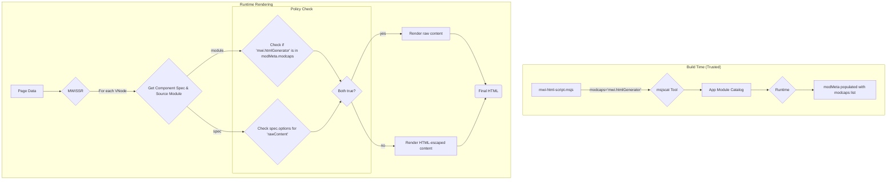

---
**Status:** ACTIVE
**History:**
- 2025-08-03: ACTIVE
**Scope:** Defines the security architecture for controlling high-risk rendering features (e.g., raw HTML generation) via a namespaced `modcaps` list in the module's SLID metadata.
**Replaces:**
**Replaced by:**
**Related:** MWI-Architecture-v3-Core.md, MWI-Component-System.md
---
# MWI Raw Content Security Policy

This document outlines the security architecture for controlling high-risk rendering options, specifically `rawContent`, by leveraging the existing module metadata system as the primary security boundary.

## 1. Problem Statement

The MWI architecture supports a `rawContent` option on component specifications. This powerful feature, which instructs the renderer to output a component's content without HTML escaping, is necessary for essential components like `h.script` and `h.style`.

However, allowing this option to be set directly within a component's registration logic creates a significant security vulnerability. If component definitions can be provided from the less-trusted Mesgjs layer (a key design goal for user extensibility), a malicious actor could set `rawContent: true` on an arbitrary element (e.g., a `<div>`), creating a classic vector for Cross-Site Scripting (XSS) attacks.

The ability to bypass HTML sanitization must be a privileged operation, strictly controlled by a trusted authority, not a self-granted capability accessible from a component's own definition.

## 2. Proposed Solution: SLID-Based Capability Grant

To address this in a scalable and idiomatic way, we will grant capabilities directly within the module's inline SLID metadata block. This leverages the primary source of truth for module identity (`modpath`) and makes the capability grant an immutable property of the module version.

The core principles of this architecture are:

1.  **Capability Declaration:** A new `modcaps` key is added to the inline SLID metadata. Its value is a string containing a space- and/or comma-separated list of namespaced permission grants (e.g., "mwi.htmlGenerator").
2.  **Trusted Configuration:** The inline SLID metadata is part of the component's source code, which is controlled by the application developer. In a multi-tenant SAAS deployment, tenant-provided modules can have their `modcaps` metadata stripped or validated during deployment.
3.  **Two-Factor Enforcement:** The renderer will require both the component's specification *and* its parent module's declared capabilities to agree before enabling high-risk features.

### 2.1. The `modcaps` Metadata Key

To prevent collisions with other libraries that might adopt this pattern, capabilities specific to the MWI subsystem **MUST** be prefixed with `mwi.`.

The inline SLID block for a module containing raw content handlers will now use the canonical `modpath` identifier and unquoted literals where appropriate:

```mesgjs
[(
    modpath=mwi/shared/components/mwi-html-script
    version=0.1.0
    featpro="mwi.components.mwiHtmlScript"
    modcaps="mwi.htmlGenerator"
)]
'' @js{ /* ... module implementation ... */ @}
```

The `msjstrans`/`msjsload` toolchain will parse this `modcaps` string and store it in the runtime `modMeta`. At runtime, `getModMeta` normalizes this value into a `NANOS` list for programmatic access.

### 2.2. Renderer Enforcement Logic

The `MWISSR` (and `MWICSR`) will enforce a two-factor check. For a `VirtualNode` to be rendered with unescaped content, **both** of the following conditions must be met:

1.  **Component Request:** The component's registered specification must explicitly request raw rendering (e.g., `options: { rawContent: true }`).
2.  **Module Grant:** The module that provides the component must have the appropriate capability (e.g., `mwi.htmlGenerator`) present in its `modMeta.modcaps` NANOS list.

The `MWIComponentRegistry` is responsible for tracking each component's source module, making this information available to the renderer.

### 2.3. System Workflow



## 3. Multi-Tenant SAAS Considerations

This approach is highly secure for multi-tenant environments. The platform's build/deployment pipeline can enforce a strict policy on the `modcaps` metadata key for any tenant-provided code, either by stripping it entirely or by validating it against a platform-defined allow-list of the tenant's permitted capabilities.

## 4. Implementation Steps

1.  Note: The `msjstrans` and `msjsload` tooling logic has been updated upstream to parse the `modcaps` key. Within this project, tests that provide their own `modMeta` must be updated to use `modcaps`.
2.  Ensure the `MWIComponentRegistry` stores the source module identifier for each registered component.
3.  Refactor the `MWISSR` to perform the two-factor check against the component's specification and its module's `modMeta.modcaps` NANOS list for the appropriate capability (e.g., `mwi.htmlGenerator`).
4.  Update the `mwi-html-script.msjs` and `mwi-html-style.msjs` files to include `modcaps="mwi.htmlGenerator"` in their inline SLID metadata.
5.  Update tests to validate the new security policy.

[supplemental keywords: security, xss, sanitization, escaping, raw html, module permissions, capabilities, namespace, modpath]