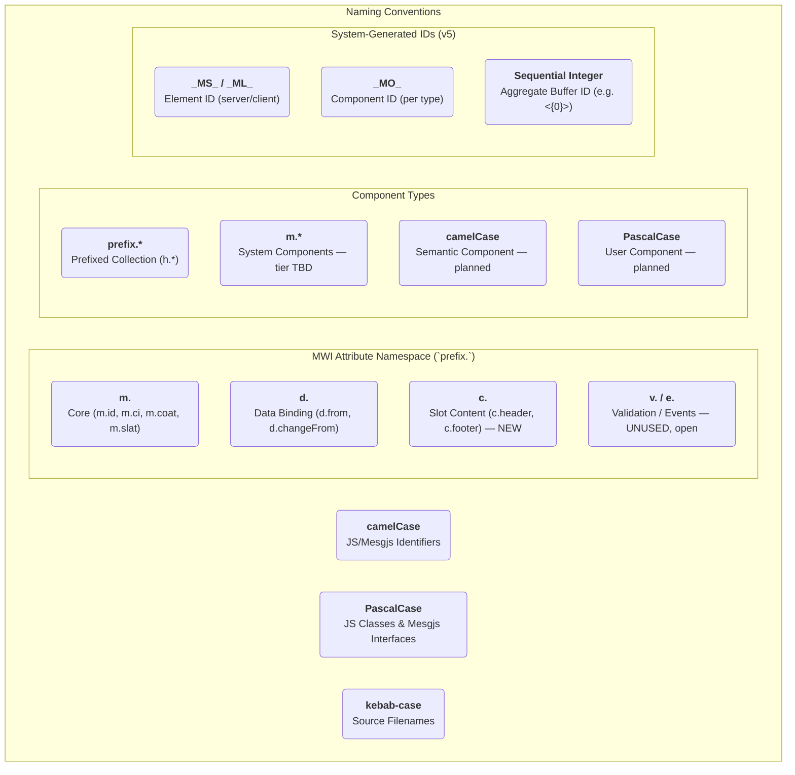

# MWI V5 Naming Conventions

**Status:** DRAFT — captures observed current state; open issues below require decisions before this can be marked STANDARD
**History:**
- 2026-08-02: DRAFT (re-established for v5; supersedes v3/v4 doc below)
**Scope:** The naming conventions for the MWI v5 project, covering identifiers, files, classes, components, attributes, and system-generated IDs.
**Replaces:** [`historical/v3-v4-architecture/Naming-Conventions.md`](../historical/v3-v4-architecture/Naming-Conventions.md)
**Replaced by:**
**Related:** [`docs/Glossary.md`](../docs/Glossary.md), [`v5-arch/core-architecture.md`](core-architecture.md)

---

## Purpose Of This Document

The v3/v4 `Naming-Conventions.md` document (now archived under `historical/v3-v4-architecture/`) established the project's original naming standards. Several of those conventions carried forward unchanged into v5; others — most notably the **system-generated ID formats** — have changed in ways that were never re-documented outside of scattered references in [`docs/Glossary.md`](../docs/Glossary.md) and individual interface docs under `docs/interfaces/`.

This document re-establishes the naming conventions as **currently observed in the v5 codebase and docs** (verified against `src/*.msjs` and `docs/**/*.md` as of 2026-08-02). Sections carried forward unchanged from the historical doc are marked accordingly. Sections that changed are marked **UPDATED FOR V5**. A dedicated [Open Issues](#open-issues--to-be-resolved) section at the end documents inconsistencies discovered during this audit that still need a decision — they are recorded here rather than silently resolved so the decision has a durable, reviewable record.

---

## Guiding Principles

*(Unchanged from historical doc)*

1. **Consistency:** Identifiers should follow a single, predictable pattern within a given context.
2. **Clarity:** Names should clearly communicate their purpose and scope.
3. **Extensibility:** Conventions should be able to accommodate new features without creating conflicts.

---

## Programmatic Identifiers: `camelCase`

*(Unchanged from historical doc)*

All programmatic identifiers, such as variables, functions, methods, and properties, **MUST** use `camelCase`. This unifies the style across both JavaScript and Mesgjs portions of the codebase.

- **Context:** JavaScript and Mesgjs code.
- **Examples:** `componentName`, `reactiveState`, `defineState`, `batchUpdate`.

User-facing MWI classes or interfaces should include an `mwi` or `MWI` prefix to identify them as part of the MWI library.

---

## File Naming: `kebab-case.extension`

**UPDATED FOR V5** — the historical doc allowed `kebab-case` *or* `PascalCase` for filenames. Observed v5 practice is exclusively `kebab-case` for source files.

- **Context:** All files in `src/`, `util/`, `bin/`, and `test/`.
- **Examples:** [`src/mwi-registry.msjs`](../src/mwi-registry.msjs), [`src/mwi-core-comp.msjs`](../src/mwi-core-comp.msjs), [`src/mwi-html-comp.msjs`](../src/mwi-html-comp.msjs), [`src/mwi-doc-node.msjs`](../src/mwi-doc-node.msjs).
- Documentation filenames under `docs/interfaces/` use a hybrid pattern: `<InterfaceName>-<kebab-case-description>.md` (e.g., [`MWIRegistry-registry.md`](../docs/interfaces/MWIRegistry-registry.md), [`MWICoreScpCSS-scoped-CSS.md`](../docs/interfaces/MWICoreScpCSS-scoped-CSS.md)).
- Architecture/planning docs under `v5-arch/` and `docs/` use `PascalCase.md` or descriptive `kebab-case.md` (e.g., [`Glossary.md`](../docs/Glossary.md), [`core-architecture.md`](core-architecture.md)) — no single rule dominates here; either is acceptable for standalone docs.

---

## Class Naming: `PascalCase`

*(Unchanged from historical doc)*

All JavaScript class names **MUST** use `PascalCase`.

- **Context:** JavaScript class definitions.
- **Examples:** `MWIDocument`, `MWIRegistry` (as seen in `src/*.msjs` `class` declarations).

---

## Mesgjs Interface Naming: `PascalCase`

**UPDATED FOR V5** — the historical doc allowed `camelCase` *or* `PascalCase`, with `camelCase` reserved for "simpler, more functional, or application-specific interfaces" (e.g. `datePicker`, `formValidator`). No `camelCase` Mesgjs interfaces exist in the current v5 codebase; every registered interface observed is `PascalCase`.

- **Context:** Mesgjs `getInterface('...')` / `featpro` declarations.
- **Examples:** `MWIRegistry`, `MWIDocument`, `MWIDocNode`, `MWICoreTpl`, `MWICoreFrag`, `MWICoreSlot`, `MWICoreText`, `MWICoreCom`, `MWICoreDefer`, `MWICoreScpCSS`, `MWIHTML`, `MWIHTMLScript`, `MWIHTMLDocType`, `MWIHTMLTitle`, `MWIAggr`, `MWIDOMSync`.
- Whether `camelCase` interfaces remain a valid *option* for future application-specific/semantic interfaces (as originally intended) is unresolved — see [Open Issues](#open-issues--to-be-resolved).

---

## Component Type Naming

**UPDATED FOR V5** — the three-tier convention itself is confirmed still in effect, but the historical table's placement of `m.*` is ambiguous and needs clarification (see [Open Issues](#open-issues--to-be-resolved)). The table below reflects current, observed usage:

| Convention | Style | Context | Example(s) |
| :--- | :--- | :--- | :--- |
| **Prefixed Collection** | `prefix.*` | Families of primitive/library components sharing a namespace. | `h.div`, `h.span`, `h.button` (backed by `MWIHTML`) |
| **System Component** *(proposed name — not yet ratified)* | `m.*` | Built-in MWI core/framework primitives. | `m.frg`, `m.slot`, `m.t`, `m.com`, `m.defer`, `m.scpcss`, `m.aggr`, `m.head`, `m.body`, `m.src` |
| **Slot-Content Attribute** | `c.*` | Named-slot target attributes (not a component type, but a related namespace convention). | `c.header`, `c.footer` |
| **Semantic Component** | `camelCase` | Library-supplied, high-level semantic components. | *(Planned; not yet implemented in v5 — see [`v5-arch/components.md`](components.md))* |
| **User Component** | `PascalCase` | Application-specific components created by end-users. | *(Planned; no concrete v5 examples yet)* |

This tiered system is intended to provide a clear, at-a-glance understanding of a component's role and source within the MWI ecosystem. Whether `m.*` deserves its own named tier (as tentatively labeled "System Component" above) or should simply be folded into "Prefixed Collection" alongside `h.*` is an open decision.

---

## Constants: `SCREAMING_SNAKE_CASE`

*(Unchanged from historical doc; confirmed via `src/mwi-registry.msjs` — `SERVER_ID_PRE`, `CLIENT_ID_PRE`, `COMP_ID_PRE`)*

Constants that represent fixed, unchanging values **MUST** use `SCREAMING_SNAKE_CASE`.

- **Context:** JavaScript and Mesgjs code.
- **Examples:** `SERVER_ID_PRE`, `CLIENT_ID_PRE`, `COMP_ID_PRE` ([`src/mwi-registry.msjs:26-28`](../src/mwi-registry.msjs)), `IF_NAME`, `READY_FT`, `FRAG_TYPE` ([`src/mwi-document.msjs`](../src/mwi-document.msjs)).

---

## MWI Attributes: `prefix.` Namespace

**UPDATED FOR V5** — the historical doc's `v.` (validation) and `e.` (event) prefixes are **not present anywhere** in the current v5 codebase or docs. `m.`, `d.`, and `c.` are confirmed in active use. See [Open Issues](#open-issues--to-be-resolved) for the disposition of `v.`/`e.`.

| Prefix | Name | Context | Example(s) | Status |
| :--- | :--- | :--- | :--- | :--- |
| `m.` | **M**WI | Core MWI virtual/special attributes: identity, computed attributes, slotting, permanent classes, rendered-node-spec tracking. | `m.id`, `m.ci`, `m.coat`, `m.slat`, `m.percl`, `m.rns`, `m.csr` | **CONFIRMED** |
| `d.` | **D**ata | Attributes related to `%*MWIData` data binding (forms). | `d.from`, `d.input`, `d.change`, `d.inputFrom`, `d.changeFrom` | **CONFIRMED** — see [`v5-arch/forms.md`](forms.md) |
| `c.` | **C**ontent | Named-slot target attributes (distinguishes slot-content attributes from regular element attributes). | `c.header`, `c.footer` | **CONFIRMED (NEW in v5)** — not present in historical doc |
| `v.` | **V**alidate | Attributes related to data validation. | `v.req`, `v.type=email` | **NOT FOUND IN V5** — see Open Issues |
| `e.` | **E**vent | Declarative event bindings. | `e.click`, `e.input` | **NOT FOUND IN V5** — see Open Issues |

The `c.` prefix is a new addition for v5, formalized in [`docs/interfaces/MWICoreSlot-slot.md:29`](../docs/interfaces/MWICoreSlot-slot.md) and [`docs/Slotting.md:84`](../docs/Slotting.md).

---

## "Pseudo-Path" Values: `.`-Separated

**UPDATED FOR V5** — examples updated to match current registry/data-binding usage.

- Component type strings registered with `MWIRegistry`:
  - `h.div`, `m.slot`, `my.button` (see [`docs/Glossary.md:17`](../docs/Glossary.md))
- Feature-promise names:
  - `mwi.compRegOpen`, `mwi.compRegReady`, `mwi.comp.MWICore`, `mwi.comp.MWIHTML`
- `%*MWIData` data-binding keys (bound via `d.*` attributes):
  - `user.email` (see [`v5-arch/forms.md:50`](forms.md)) — Note: per `forms.md:62`, separator characters in binding keys are for *visual organizational effect only*; bindings are structurally flat, not nested paths. This differs from the historical doc's implication that these are hierarchical paths.
- Aggregation buffer keys:
  - Format `<namespace>:<bufferName>`, e.g. `m.aggr:default`, `m.script:head`, `m.style:head` (see [`docs/interfaces/MWIAggr-aggregate-content.md:93`](../docs/interfaces/MWIAggr-aggregate-content.md), [`docs/interfaces/MWIAggrScript-script-style.md:167`](../docs/interfaces/MWIAggrScript-script-style.md))
- Note: module paths reflect actual filesystem paths and therefore follow file-naming conventions rather than pseudo-path conventions.

---

## System-Generated IDs

**UPDATED FOR V5** — this section replaces the historical doc's single `MWS$`/`MWC$` element-ID convention with **three distinct, currently-implemented ID namespaces**, none of which use the old `$`-suffixed, JS-identifier-safe format. See [Open Issues](#open-issues--to-be-resolved) for a naming collision between two of these namespaces that should be resolved.

### 1. Element ID — Per Doc-Node Instance

Identifies a specific doc-node *instance*. Generated by `MWIRegistry.nextId()`.

- **Server:** `_MS_<base36>` (e.g., `_MS_0`, `_MS_1j`; (s)erver)
- **Client:** `_ML_<base36>` (e.g., `_ML_0`, `_ML_a4`; c(l)ient)
- Separate server/client namespaces prevent collisions; no cross-sync needed.
- Source: [`src/mwi-registry.msjs:26-27,89`](../src/mwi-registry.msjs), documented in [`docs/interfaces/MWIRegistry-registry.md:57-61,71-74`](../docs/interfaces/MWIRegistry-registry.md).

### 2. Component ID — Per Component *Type*

Identifies a registered component *type* (not instance). All instances of the same component type share the same Component ID. Used for scoped-CSS class names and the `@@` shortcut (`m.ci`).

- **Format:** `_MO_<base36>` (e.g., `_MO_0`, `_MO_1`; c(o)mponent)
- Assigned once at registration time by `MWIRegistry`.
- Must synchronize server → client (passed via `globalThis.mwiServer.at('components')`).
- Source: [`src/mwi-registry.msjs:28,111-116,176-178`](../src/mwi-registry.msjs), confirmed by tests in [`test/core/registry.test.js:139-200`](../test/core/registry.test.js), documented in [`docs/interfaces/MWIRegistry-registry.md:65-69`](../docs/interfaces/MWIRegistry-registry.md), [`docs/Glossary.md:19`](../docs/Glossary.md).

### 3. Aggregate Buffer ID — Per Aggregation Placeholder

Identifies a numbered SSR placeholder (`<{id}>`) for content aggregated via `m.aggr` `from` mode, later substituted by `MWIDocument.getHTML()`.

- **Format:** Sequential integer (e.g., `0`, `1`, `2`).
- **Placeholder Format:** `<{id}>` (e.g., `<{0}>`, `<{1}>`).
- Generated by `mapAggrBuffer()`, which assigns and returns the sequential `nextAggrId` counter.
- Source: [`src/mwi-document.msjs:205-215,251-252`](../src/mwi-document.msjs), confirmed by `ssrAggrFrom` in [`src/mwi-aggr-comp.msjs:102-109`](../src/mwi-aggr-comp.msjs), documented in [`docs/interfaces/MWIAggr-aggregate-content.md:29,98-100`](../docs/interfaces/MWIAggr-aggregate-content.md).
- **Note:** There is zero connection between Aggregate Buffer IDs and Component IDs or formatting. The method `MWIDocument.compIdStr(id)` is a helper to format a Component ID (using `_MO_`), and is completely unrelated to Aggregate Buffer IDs.

### Superseded: `$`-Suffixed Format

The historical `MWS$`/`MWC$` format (chosen so IDs were valid JS identifiers usable as proxy-object properties, e.g. `window.MWS$0`) is **no longer used anywhere in v5**. No `$`-suffixed ID generation was found in `src/`. If proxy-object DOM access by ID is still a desired feature, it has not carried forward and would need to be re-specified against the current `_MS_`/`_ML_` format.

---

## JavaScript Function And Method Declarations

*(Unchanged from historical doc; confirmed still followed throughout `src/*.msjs`)*

Place a space between the function or method name and the parameter list to help distinguish between a definition and a use in intra-file text searches.

- `function name (...params) { ... }`, `methodName (...params) { ... }`
- `name(...params)`, `object.methodName(...params)`

---

## Open Issues / To Be Resolved

These are inconsistencies and open questions discovered while auditing the current v5 codebase and docs against the historical naming conventions. They are recorded here, deliberately unresolved, pending a decision.

### 1. `v.` and `e.` attribute prefixes — unused in v5

The historical doc reserved `v.` for validation attributes and `e.` for declarative event bindings. Neither appears anywhere in the current v5 `src/` or `docs/` trees. [`v5-arch/forms.md`](forms.md) instead relies on native HTML5 validation attributes directly (`required`, `min`, `max`, `pattern`, etc.) with no `v.` namespace, and no declarative `e.*` event-attribute mechanism was found (forms.md's event handling is described in terms of internal delegated listeners, not user-facing `e.*` attributes).

Possible resolutions:
- Formally drop `v.` and `e.` from the v5 conventions (mark as **RETIRED**), since HTML5 native validation + internal event delegation appear to have replaced the need for them.
- Or, mark them **RESERVED** for planned future use and keep them in the table as placeholders.

### 2. Tier classification of the `m.*` namespace

The historical three-tier Component Type table (Prefixed Collection / Semantic Component / User Component) does not cleanly account for `m.*` built-in system components (`m.frg`, `m.slot`, `m.t`, `m.com`, `m.defer`, `m.scpcss`, `m.aggr`, `m.head`, `m.body`, `m.src`, etc.). These aren't really a "family of primitive/related library components" in the same sense as `h.*` (HTML tags) — they're core framework primitives.

Possible resolutions:
- Add `m.*` as its own explicit tier (tentatively labeled "System Component" in the table above).
- Or, fold `m.*` into the existing "Prefixed Collection" tier alongside `h.*`, treating both as namespace-prefixed families without further distinction.

### 3. Stale "Scope ID" (`MWI-<base36>-`) references in architecture docs

[`v5-arch/core-architecture.md:30`](core-architecture.md) and [`v5-arch/ssr-csr-hydration.md:332`](ssr-csr-hydration.md) / [`v5-arch/ssr-csr-hydration-v2.md:235`](ssr-csr-hydration-v2.md) describe a separate "Scope ID" system (`MWI-<base36>-`) for scoped CSS, synchronized server-to-client alongside Component IDs. This concept traces back to the v3 implementation ([`historical/src-v3/server/services/MWIScopeManagerService.esm.js:19-24`](../historical/src-v3/server/services/MWIScopeManagerService.esm.js)) and v3/v4 planning docs ([`historical/v3-v4-architecture/MWI-Architecture-v3-Resources.md:93-97`](../historical/v3-v4-architecture/MWI-Architecture-v3-Resources.md)).

No such "Scope ID" generation exists anywhere in the current `src/` implementation. Scoped CSS in v5 reuses the **Component ID** (`_MO_<base36>`) directly as the CSS scope/class name (confirmed in [`docs/interfaces/MWICoreScpCSS-scoped-CSS.md:25-31`](../docs/interfaces/MWICoreScpCSS-scoped-CSS.md) and tests in [`test/core/scoped-css.test.js:52-53`](../test/core/scoped-css.test.js)) — there is no separate scope-ID namespace or synchronization step.

Possible resolutions:
- Update `core-architecture.md` and the `ssr-csr-hydration*.md` docs to remove the stale "Scope ID" references and clarify that Component ID (`_MO_`) serves this purpose directly.
- Or, if a distinct Scope ID system is still planned for some future reason (e.g. decoupling CSS scoping from component-type identity), explicitly re-specify it here and reconcile with the `_MO_`-based approach currently implemented.

### 4. Stale `mci-N` example format in slot-source docs

[`docs/interfaces/MWICoreSource-slot-source.md:95,162`](../docs/interfaces/MWICoreSource-slot-source.md) contains examples showing `m.ci` values like `"mci-42"` and `"mci-7"`, and derived output like `class="mci-42__card"` / `data-ci="mci-7"`. This does not match the actual Component ID format (`_MO_<base36>`) used consistently everywhere else in the codebase and docs (registry, scoped CSS, tests). These examples appear to predate the current ID format and were never updated.

Possible resolution:
- Update the examples in `MWICoreSource-slot-source.md` to use realistic `_MO_<base36>` values (e.g. `_MO_2a`) and correct any derived output (class names, `data-ci` values) to match.

---

## Plan Summary Diagram

This diagram visualizes the v5 naming conventions documented above, including open/uncertain areas.

---

## Sorting Conventions

To ensure consistency in sorted lists of identifiers (e.g., in documentation, catalogs, or UI elements), the following sorting rules **MUST** be applied.

### Case-Based Capitalization (`camelCase`, `PascalCase`)

Sorting **MUST** be performed in a case-insensitive, lexicographical order.

- **Context:** `camelCase` or `PascalCase` identifiers.
- **Example:** `loggedType` comes before `logInterfaces` (because `g` comes before `i`).

### Separator-Based Capitalization (`kebab-case`, `snake_case`)

Sorting **MUST** be performed by comparing the "words" of the identifier, which are separated by the relevant separator (`-` or `_`).

- **Context:** `kebab-case` or `snake_case` identifiers.
- **Example:** `log-interfaces` comes before `logged-type` (because `log` comes before `logged`).

### Hybrid Conventions

When an identifier uses a mix of conventions (e.g., dot-separated `camelCase` terms), sorting rules **MUST** be applied hierarchically.

- **Context:** `%*MWIData` paths, feature-promise names.
- **Example:** For `a.loggedType` and `a.logInterfaces`, the first segment (`a`) is identical. The second segment is then sorted using case-based rules, meaning `a.loggedType` comes before `a.logInterfaces`.

[supplemental keywords: hydration, scopedCss, component id, element id, aggregate buffer id, base36, sorting, lexicographical, case-insensitive, naming conventions, v5, prefix, camelCase, PascalCase, kebab-case]
