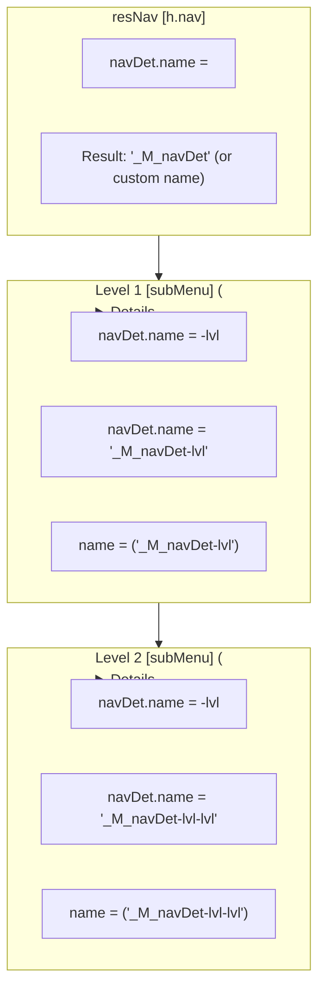
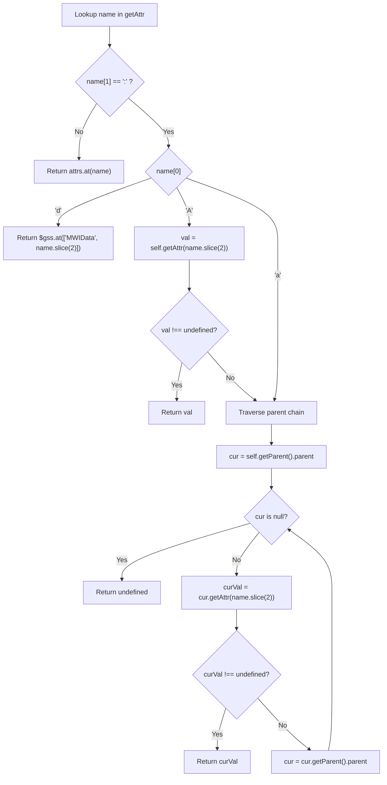

# Ancestral (`a:`, `A:`) and Data (`d:`) Attribute Prefixes in `getAttr` and `computeAttr`

**Status:** [APPROVED]  
**Created:** 2026-09-01  
**Last updated:** 2026-09-02  
**Author:** Architectural specification — Brian Katzung + AI partner  

---

## 1. Overview and Motivation

In MWI / Mesgjs document trees, nodes require access to four distinct tiers of data:

1. **Slot Source Attributes (`<name>`):** Values passed down through slot/component boundaries (e.g. caller props), queried via [`slotSrc?.getAttr(name)`](../src/mwi-doc-node.msjs:129).
2. **Global Shared Data (`<d:key>`):** Values stored in the global `%*MWIData` reactive store in `$gss`.
3. **Strictly Ancestral Doc Tree Context (`<a:name>`):** Values inherited strictly from ancestor nodes above the current node in the rendered doc node tree hierarchy (excluding the current node itself).
4. **Local or Ancestral Doc Tree Context (`<A:name>`):** Values retrieved from the current node itself if defined, falling back to ascending ancestor nodes in the doc node tree hierarchy.

### 1.1 Moving `d:`, `a:`, and `A:` to `getAttr`

Previously, `d:` was handled only inside the private helper [`computeAttr`](../src/mwi-doc-node.msjs:98), while ancestral lookups were not supported. Moving domain-prefixed lookups directly into [`MWIDocNode.prototype.getAttr`](../src/mwi-doc-node.msjs:481) establishes a unified, consistent data access model:
- Any node can query global data or ancestral attributes via [`node.getAttr('d:key')`](../src/mwi-doc-node.msjs:545), [`node.getAttr('a:name')`](../src/mwi-doc-node.msjs:538), or [`node.getAttr('A:name')`](../src/mwi-doc-node.msjs:531) in both Mesgjs and JavaScript.
- [`applySlat`](../src/mwi-doc-node.msjs:73) and [`computeAttr`](../src/mwi-doc-node.msjs:98) share the identical source distinction: standard attribute names evaluate against `slotSrc?.getAttr(name)`, whereas `a:`, `A:`, and `d:` prefixed attributes evaluate against the target node itself (`self.getAttr(name)`).
- [`m.slat`](../src/mwi-doc-node.msjs:73) mappings (e.g., `m.slat=[theme=[d:currentTheme]]` or `m.slat=[section=[a:sectionName]]`) work consistently because `applySlat` delegates domain-prefixed queries to `self`.

### 1.2 The `a:` vs `A:` Distinction

- **`a:` (Strictly Ancestral):** Searches only parent and ancestor nodes starting from `self.getParent().parent` (`ps.at(['rxState', 'parent'])`). The current node's own attributes are ignored. This is essential when calculating a new level-dependent value based on what the enclosing context provided (e.g., nesting depth or hierarchical naming).
- **`A:` (Local or Ancestral):** Checks the current node (`self`) first. If `self.getAttr(name)` is defined (not `undefined`), that value is returned. Otherwise, it traverses up the ancestor chain. This is ideal for inherited defaults that can be optionally overridden at the local element level.

---

## 2. Motivating Use Case: Multi-Level Native Accordion Navigation

HTML5 supports native accordion behavior on `<details>` elements via the `name` attribute: all `<details>` elements sharing the same `name` attribute value belong to an exclusive accordion group where opening one automatically closes any other open `<details>` in that group.

### 2.1 Intent and Requirements

1. **Independent Level Accordions:** Each level accordions independently of other levels within a menu tree via a level-specific number of `"-lvl"` suffixes (e.g., Level 1: `_M_navDet-lvl`, Level 2: `_M_navDet-lvl-lvl`), ensuring that opening a Level 2 sub-menu never closes the enclosing Level 1 parent.
2. **Mutual Awareness vs Separation:** Entire nav trees across all levels are mutually aware by default (using the default root prefix `_M_navDet`), or can be separated by configuring a unique `name` attribute on `[resNav]` (e.g. `[resNav name="siteNav"]` in the event of multiple independent navigation trees on a single page).
3. **Purpose-Specific Scoped Namespace (`navDet.name`):** Multiple navigation components (e.g., `[subMenu]`, `[megaMenu]`) share a dedicated attribute namespace (`navDet.name`) rather than querying generic `<a:name>` (which could match arbitrary enclosing forms, sections, or input elements).

### 2.2 Component Template Specifications

#### 1. In `[resNav]` Root Navigation Component:
```javascript
// On [h.nav] inside [resNav] template:
[h.nav m.coat=[navDet.name=<name|_M_navDet>]]
```
*The menu tree root prefix is established on the `<nav>` container from the `[resNav]` component's `name` attribute, falling back to `'_M_navDet'` by default.*

#### 2. In `[subMenu]` and `[megaMenu]` Components:
```javascript
// On [h.details] inside [subMenu] / [megaMenu] template:
[h.details m.coat=[navDet.name=<a:navDet.name>-lvl name=<A:navDet.name>]]
```

### 2.3 Resolution Walkthrough



1. **Root (`[resNav]` container):**
   - `<nav>` sets `navDet.name` to `"_M_navDet"` (or `<name>` if `[resNav name="customNav"]` is specified).
2. **Level 1 Sub-Menu (`[subMenu]` inside `[resNav]`):**
   - `<details>` evaluates `<a:navDet.name>-lvl` against the ancestor `<nav>` → `"_M_navDet-lvl"`.
   - `name` evaluates `<A:navDet.name>` → `"_M_navDet-lvl"`.
   - All Level 1 sub-menus in this tree share `name="_M_navDet-lvl"` and accordion together.
3. **Level 2 Sub-Menu (Nested `[subMenu]` inside Level 1):**
   - `<details>` evaluates `<a:navDet.name>-lvl` against the Level 1 ancestor `<details>` → `"_M_navDet-lvl-lvl"`.
   - `name` evaluates `<A:navDet.name>` → `"_M_navDet-lvl-lvl"`.
   - All Level 2 sub-menus in this branch accordion independently without closing the Level 1 parent `<details>`.
4. **Deeply Nested Sub-Menus (Level 3+):**
   - Each deeper nesting level appends another `"-lvl"` suffix, scoping accordion behavior exclusively to that tier.

---

## 3. Specification & Semantics

### 3.1 Prefix Resolution Table

| Reference | Scope / Target | Resolution Mechanism |
|---|---|---|
| `<attrName>` | **Slot Source** | [`slotSrc?.getAttr(attrName)`](../src/mwi-doc-node.msjs:129) |
| `<d:keyName>` | **Global Shared Store** | `$gss.at(['MWIData', keyName])` |
| `<a:attrName>` | **Strict Ancestor** | Traverses `self.getParent().parent` up doc tree until `parent.getAttr(attrName) !== undefined` |
| `<A:attrName>` | **Local or Ancestor** | Checks `self.getAttr(attrName)`; if `undefined`, traverses `self.getParent().parent` up doc tree |

### 3.2 Resolution Logic & Flowcharts



### 3.3 Full Operator Compatibility

All `computeAttr` operators work identically with `a:`, `A:`, and `d:` prefixes:
- `<a:resNav.name|resNav>` — Fallback if unset (`undefined` or `false`)
- `<a:theme||dark>` — Fallback if unset or empty string (`""`)
- `<A:compact?btn-compact|btn-normal>` — Conditional boolean test
- `<a:section?sec-<a:section>|default>` — Nested expressions

### 3.4 Chained Fallback Syntax (`<opt1|opt2|opt3>`) vs. Toggle Behavior

Currently, [`computeAttr`](../src/mwi-doc-node.msjs:168) treats `|` as a binary state toggle (`copy = !copy`), which works for simple if/else expressions (`<cond?then|else>` or `<val|fallback>`) but does not support multi-tier fallback chains like `<opt1|opt2|opt3>`.

**Proposed Enhancement:** [Status: REJECTED; Do Not Implement]

Update fallback evaluation in [`computeAttr`](../src/mwi-doc-node.msjs:98) so that chained vertical bars (`<opt1|opt2|opt3>`) evaluate successive options until the first defined (or non-empty for `||`) value is found:
- For `<a|b|c>`: If `a` is defined, use `a`. Else if `b` is defined, use `b`. Else use `c`.
- This enables clean multi-tier fallback expressions such as `<name|resNav.name|<a:resNav.name|resNav>-lvl>`.
- This would be a breaking change, ~~but the semantics are far more useful and likely closer to users' initial expectations~~.

Further analysis:
- In `<a|b|c>`, `a` is a *property name*; in contrast, `b` and `c` are (potentially compound) *strings*.
- Adding the concept of unset(-or-empty) *computed strings* would add both implementation and cognitive complexity.
- Chained fallbacks are already possible (albeit more verbosely) with the existing syntax.

### 3.5 Reactivity

- `rxState.parent` and doc node `attrs` are reactive NANOS structures.
- Reparenting a node or modifying an ancestor attribute automatically invalidates and recalculates dependent `a:` and `A:` computed expressions in `_mCoat`.
- Updates to `$gss.at(['MWIData', key])` reactively trigger recomputation for `d:` expressions.

---

## 4. Implementation Details

### 4.1 Changes in [`src/mwi-doc-node.msjs`](../src/mwi-doc-node.msjs)

#### 1. In [`MWIDocNode.prototype.getAttr`](../src/mwi-doc-node.msjs:481):

```javascript
if (name[1] === ':') { // Domain-qualified names
    const subName = name.slice(2);

    switch (name[0]) {
    case 'A': // A:name - local or ancestral value
    {
        const value = self.getAttr(subName);

        if (value !== undefined) return value;
        // Fall through...
    }
    case 'a': // a:name - ancestral value
        for (let parent = self.getParent().parent; parent; parent = parent.getParent().parent) {
            const value = parent.getAttr(subName);

            if (value !== undefined) return value;
        }
        return undefined;
    case 'd': // d:name - %*MWIData value
        return $gss.at(['MWIData', subName]);
    }
}
```

#### 2. In [`applySlat`](../src/mwi-doc-node.msjs:73) and [`computeAttr`](../src/mwi-doc-node.msjs:98):

Both helpers use the identical source resolution distinction so that domain-prefixed lookups query the target node `self`:

```javascript
// In applySlat (line 87):
const source = (name[1] === ':' && 'aAd'.indexOf(name[0]) >= 0) ? self : slotSrc;
const value = source?.getAttr(name) ?? spec.at('else');

// In computeAttr (line 127):
const source = (name[1] === ':' && 'aAd'.indexOf(name[0]) >= 0) ? self : slotSrc;
return source?.getAttr(name);
```

### 4.2 Updates in [`src/mwi-res-nav.msjs`](../src/mwi-res-nav.msjs)

Update `[resNav]`, `[subMenu]`, and `[megaMenu]` component templates to use the scoped accordion naming pattern:

```javascript
// In [resNav]:
#registry(register #NAV [tpl=[
    [h.div m.percl='@@'
        [h.details [h.summary         // portrait-mode nav-rail opener
            [h.span class=closed]
            [h.span class=open]
        ]]
        [h.div [m.slot name=c.left]]  // left-of-nav (e.g. branding)
        [h.nav m.coat=[navDet.name=<name|_M_navDet>]
            [h.div [m.slot]]          // main nav menu
        ]
        [h.div [m.slot name=c.right]] // right-of-nav (e.g. profile menu)
    ]
] scopedCSS="..."])

// In [subMenu]:
#registry(register #SUB [tpl=[
    [h.details m.coat=[navDet.name=<a:navDet.name>-lvl name=<A:navDet.name>]
        [h.summary [m.slot name=c.label]]
        [m.slot]
    ]
]])

// In [megaMenu]:
#registry(register #MEGA [tpl=[
    [h.details m.coat=[navDet.name=<a:navDet.name>-lvl name=<A:navDet.name>]
        [h.summary [m.slot name=c.label]]
        [m.slot]
    ]
]])
```

---

## 5. Documentation Updates Plan

The following documentation files will be updated to document `a:`, `A:`, and `d:` prefixes:

### 5.1 [`docs/interfaces/MWIDocNode-document-node.md`](../docs/interfaces/MWIDocNode-document-node.md)

1. **`getAttr(name)` Method Section:**
   - Document domain-qualified prefix lookups:
     - `d:key` — Reads from global store `$gss.at(['MWIData', key])`.
     - `a:name` — Strictly ancestral lookup traversing parent nodes (excluding `self`).
     - `A:name` — Local or ancestral lookup checking `self` first, then traversing parents.
2. **`m.coat` Section:**
   - Document `<a:name>` (strictly ancestral context) and `<A:name>` (local or ancestral context) in the expression syntax reference.
   - Add examples showcasing nested accordion structures with `<a:resNav.name|resNav>-lvl`.
   - Document `<d:name>` global shared store access.
3. **`m.slat` Section:**
   - Clarify how `m.slat` supports mapping from `d:`, `a:`, and `A:` source attributes.

### 5.2 [`docs/Slotting.md`](../docs/Slotting.md)

1. **`m.coat` Expression Syntax Table:**
   - Add `<a:name>` (ancestral attribute lookup) and `<A:name>` (local or ancestral lookup).
   - Add `<d:name>` (global `MWIData` store lookup).
2. **Nested Components & Hierarchical Data Section:**
   - Add subsection explaining ancestral attribute lookup across nested template/slot hierarchies without needing manual prop forwarding through every intermediate container.

### 5.3 [`docs/Glossary.md`](../docs/Glossary.md)

1. **New Term Entries:**
   - **`a:` prefix**: Strictly ancestral attribute lookup prefix in `getAttr` and `m.coat`/`m.slat`.
   - **`A:` prefix**: Local-or-ancestral attribute lookup prefix in `getAttr` and `m.coat`/`m.slat`.
   - **`d:` prefix**: Global shared data (`MWIData`) lookup prefix in `getAttr` and `m.coat`/`m.slat`.
2. **Updated Terms:**
   - **`m.coat`**: Update description to include slot source, ancestral (`a:`, `A:`), and global (`d:`) access.
   - **`m.slat`**: Update description to note support for prefixed attribute resolution.

---

## 6. Test Plan

### 6.1 Direct `getAttr` Unit Tests ([`test/core/doc-node.test.js`](../test/core/doc-node.test.js) & [`test/core/node-parent.test.js`](../test/core/node-parent.test.js))
- `node.getAttr('d:key')` reads from `%*MWIData`.
- `child.getAttr('a:attr')` finds closest ancestor defining `attr` (skips `child.attr`).
- `child.getAttr('A:attr')` returns `child.attr` if defined; otherwise finds closest ancestor.
- `child.getAttr('a:m.ci')` finds closest ancestor component ID.
- `child.getAttr('a:nonexistent')` and `child.getAttr('A:nonexistent')` return `undefined`.
- Unparented `node.getAttr('a:attr')` returns `undefined`.

### 6.2 `m.coat` / `computeAttr` Tests ([`test/ssr-html/mcoat.test.js`](../test/ssr-html/mcoat.test.js))
- `<a:theme>` in `m.coat` across SSR rendering.
- `<a:theme|default>` fallback in SSR HTML.
- `<A:theme|default>` resolving locally when set on node vs inheriting from ancestor.
- Scoped accordion naming pattern: `<a:navDet.name>-lvl` across multi-level nested templates within `[resNav]` (Level 1: `_M_navDet-lvl`, Level 2: `_M_navDet-lvl-lvl`, Level 3: `_M_navDet-lvl-lvl-lvl`, or custom root name e.g. `siteNav-lvl`).
- `<d:theme>` in `m.coat` continues to work seamlessly.

### 6.3 `m.slat` Tests ([`test/core/source.test.js`](../test/core/source.test.js), [`test/ssr-html/source.test.js`](../test/ssr-html/source.test.js))
- `m.slat=[theme=[d:user.theme]]` passes MWIData attribute to slot target via `getAttr`.
- `m.slat=[theme=[a:theme]]` passes ancestor attribute to slot target via `getAttr`.
- `m.slat=[theme=[A:theme]]` passes local/ancestral attribute to slot target via `getAttr`.

### 6.4 CSR DOM & Reactivity Tests ([`test/csr-dom/doc-node.test.js`](../test/csr-dom/doc-node.test.js))
- Mutation of ancestor attribute propagates reactively to descendant DOM attributes using `a:` and `A:`.
- Reparenting a subtree updates ancestral attributes reactively.
- `%*MWIData` mutation updates `d:` bindings in `m.coat` and `m.slat` reactively.
