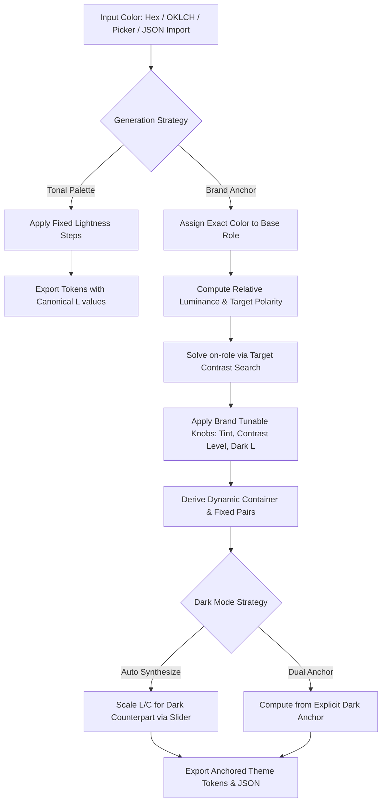

# Architecture Specification: Anchored Brand Color Mode

## 1. Executive Summary & Problem Statement

The **MWI Theme Color Generator** currently operates under a **Fixed-Tonal Paradigm** ([`v5-arch/theme-color-tool.md`](v5-arch/theme-color-tool.md:8)). In this model, input colors serve exclusively as a seed for *hue* and *chroma*, while their *lightness* ($L$) is discarded in favor of predefined target steps ($L = 0.40$ for light `--color-primary`, $L = 0.80$ for dark `--color-primary`).

While mathematically robust for generating harmonious Material-style ramps, this model fails real-world brand requirements where organizations mandate an **exact brand color** (e.g. corporate hex `#0052CC` or `#E11D48`) for `--color-primary` without lightness shifts.

This specification defines the architecture, mathematical algorithms, UI interactions, JSON configuration import/export schemas, and automated test suite required to add an **Anchored Brand Color Mode** with user-tunable consistency knobs to the MWI Theme Color Generator.

---

## 2. Dual Generation Strategy Architecture

The generator supports two orthogonal generation strategies:

| Strategy | Primary Input Meaning | Lightness Handling | Target Use Case |
|---|---|---|---|
| **Tonal Palette Mode** *(Default / Current)* | Seed for Hue & Chroma | Lightness quantized to canonical steps ($L=0.40$ / $L=0.80$) | Clean slate theme generation, design system baseline palettes |
| **Anchored Brand Mode** *(New)* | Exact target color for `--color-$ROLE` | Lightness preserved exactly as specified; partner & container tokens derived dynamically | Integrating existing brand identities, strict design compliance |



---

## 3. Mathematical Principles & Contrast Solving

### 3.1 Relative Luminance and Polarity Determination

For an anchored base color $C_{\text{anchor}} = (L_a, C_a, H_a)$, the engine computes sRGB relative luminance $Y_a$ using [`getRelativeLuminanceFromOklch()`](util/color-token-generator/js/color-engine.esm.js:22).

To determine whether the partner text token `--color-on-$ROLE` should be light or dark:
- If $Y_a \le 0.18$ (Dark surface, roughly $L_a < 0.50$): Target a **light text partner**.
- If $Y_a > 0.18$ (Light surface, roughly $L_a \ge 0.50$): Target a **dark text partner**.

### 3.2 Dynamic Partner Lightness Solver

The partner color $C_{\text{on}}$ is determined by optimizing lightness $L_{\text{on}}$ while minimizing chroma $C_{\text{on}} \le 0.02$ (or user-tuned `partnerChroma`) to ensure legible text:

1. **For Light Partner Target**:
   - Start search at $L = 0.99, C = \text{partnerChroma}$.
   - Calculate contrast ratio $R = \text{calculateContrastRatio}(Y_a, Y(L, C, H))$.
   - If $R \ge R_{\text{target}}$ (4.5 for AA, 7.0 for AAA), lock $L_{\text{on}} = 0.99$.
   - If $R < R_{\text{target}}$, test $L \in [0.95, 1.0]$. If maximum achievable ratio $< R_{\text{target}}$, flag a **Contrast Warning**.

2. **For Dark Partner Target**:
   - Start search at $L = 0.10, C = \text{partnerChroma}, H = H_a$.
   - Calculate contrast ratio $R$.
   - If $R \ge R_{\text{target}}$, lock $L_{\text{on}}$.
   - If $R < R_{\text{target}}$, step $L$ down toward $0.02$. If $R < R_{\text{target}}$ at $L=0.0$, flag a **Contrast Warning**.

### 3.3 The Mid-Tone "Dead Zone" ($0.45 \le L \le 0.65$) & Auto-Tune

Colors in the perceptual middle luminance band (such as saturated pure cyan `#00FFFF`, bright lime `#00FF00`, or standard amber `#FF9900`) cannot achieve 4.5:1 against either `#000000` or `#FFFFFF`.

When an anchor falls into this zone:
- The UI displays an inline contrast advisory: `⚠️ Anchor #... cannot meet 4.5:1 against standard text (Max: X.X:1)`.
- The UI exposes a one-click action: **"✨ Auto-tune to 4.5:1"** with an optional preference switch (Darken to $L \le 0.38$ vs Lighten to $L \ge 0.72$).
- Auto-tuning computes the minimal lightness offset $\Delta L$ necessary to achieve exactly the target contrast against the chosen pole.

### 3.4 Determinism and Reproducibility

The entire pipeline is **100% deterministic and mathematically reproducible**:
1. **No Stochastic Operations**: All calculations (relative luminance, contrast ratio, gamut clipping, bounded monotonic solver) are pure, closed-form mathematical operations.
2. **Deterministic Outputs**: Given identical inputs $(L_a, C_a, H_a)$ and knob configurations $(K_{\text{tint}}, K_{\text{darkL}}, \dots)$, the solver calculates the exact same OKLCH channels, linear sRGB matrices, and hex strings every run.
3. **Lossless Round-Trip Import/Export**: Every export includes full serialization in CSS comments and structured JSON configurations. A dedicated JSON Import engine parses and restores every slider, mode switch, and anchor channel accurately.

### 3.5 Tunable Brand Consistency Knobs & Guardrails

To allow designers to balance strict brand guidelines with visual aesthetics within safe accessibility guardrails, the following user-tunable knobs are provided in an **"Advanced Brand Tuning"** panel:

| Tunable Knob | Parameter Key | Range & Default | Purpose & Visual Effect | Accessibility Guardrail |
|---|---|---|---|---|
| **Container Tint Intensity** | `containerChromaFactor` | `0.10 – 0.60` (Default: `0.35`) | Controls the vibrancy/saturation of container backgrounds (subtle pastel vs punchy brand tint). | Clamped automatically if sRGB gamut boundary is exceeded; re-evaluates contrast against `on-container`. |
| **Container Lightness** | `containerLightness` | `0.80 – 0.96` (Default: `0.90`) | Controls how bright/recessed container cards appear against page surfaces. | Dynamically verified to ensure $\ge 4.5:1$ contrast against `--color-on-container`. |
| **Dark Theme Brand Lightness** | `darkTargetLightness` | `0.70 – 0.88` (Default: `0.80`) | Adjusts how luminous the primary interaction token is in dark mode. | Enforces $\ge 4.5:1$ against dark mode `--color-on-primary` ($L \approx 0.15$). |
| **Partner Text Contrast Target** | `minContrastRatio` | `4.5` (AA) or `7.0` (AAA) | Enforces minimum legibility standard for on-brand text. | Strict enforcement with real-time pass/fail status badges. |
| **Partner Hue Tinting** | `partnerChroma` | `0.00 – 0.04` (Default: `0.00`) | Adds a subtle hint of the brand hue to body/partner text instead of stark monochrome white/black. | Luminance is recalculated to guarantee contrast compliance. |
| **Mid-Tone Auto-Tune Preference** | `autoTuneDirection` | `darken` ($L \le 0.38$) vs `lighten` ($L \ge 0.72$) | For anchors in the mid-tone dead zone ($0.45 \le L \le 0.65$), chooses whether auto-tuning pushes toward a dark anchor (white text) or light anchor (dark text). | Computes minimal $\Delta L$ shift to hit exact target ratio. |

---

## 4. Codebase Modifications

### 4.1 [`util/color-token-generator/js/color-engine.esm.js`](util/color-token-generator/js/color-engine.esm.js)

Add contrast-solving and auto-tuning helper functions:

```javascript
/**
 * Find the optimal partner lightness for an anchor color to satisfy WCAG AA/AAA.
 * @param {Object} anchorOklch - { l, c, h }
 * @param {Object} [options] - { minRatio: 4.5, targetPolarity: 'auto' | 'light' | 'dark', chroma: 0.0 }
 * @returns {Object} { partnerOklch, ratio, passesAA, passesAAA, polarity }
 */
export function solvePartnerColor(anchorOklch, options = {});

/**
 * Calculate the minimal lightness adjustment required to bring an anchor into WCAG compliance.
 * @param {Object} anchorOklch - { l, c, h }
 * @param {number} [targetRatio=4.5]
 * @param {'auto' | 'darken' | 'lighten'} [direction='auto']
 * @returns {Object} { adjustedOklch, deltaL, direction }
 */
export function calculateComplianceAdjustment(anchorOklch, targetRatio = 4.5, direction = 'auto');
```

### 4.2 [`util/color-token-generator/js/role-recipes.esm.js`](util/color-token-generator/js/role-recipes.esm.js)

1. Introduce `DEFAULT_BRAND_TUNING`:
   ```javascript
   export const DEFAULT_BRAND_TUNING = {
     containerChromaFactor: 0.35,
     containerLightness: 0.90,
     minContrastRatio: 4.5,
     partnerChroma: 0.0,
     darkTargetLightness: 0.80,
     autoTuneDirection: 'auto',
   };
   ```
2. Introduce `generateAnchoredChromaticTokens(familyId, anchorOklch, options)`:
   - Emits light mode `--color-$ROLE` using the exact `anchorOklch`.
   - Computes dynamic partner and container tokens using user tuning-knobs and [`solvePartnerColor()`](util/color-token-generator/js/color-engine.esm.js:1).
   - Returns compliance diagnostic flags (`isMidToneWarning`, `maxPossibleRatio`, `suggestedAdjustment`).
3. Update `generateTokens(familyId, config)` to route between tonal and anchored generation paths.

### 4.3 [`util/color-token-generator/js/token-exporter.esm.js`](util/color-token-generator/js/token-exporter.esm.js)

1. Update CSS header reproduction metadata to include strategy and brand tuning knobs:
   ```css
   /* ==========================================================================
      MWI Theme Tokens: Primary (Anchored Brand Mode)
      Source: oklch(45.2% 0.18 260) | Strategy: anchored | Gamut: sRGB OK
      Reproduce: {"family":"primary","strategy":"anchored","anchorHex":"#0052CC","tuning":{"containerChromaFactor":0.35,"containerLightness":0.90,"minContrastRatio":4.5,"darkTargetLightness":0.80}}
      ========================================================================== */
   ```
2. Update JSON export schema in [`formatJsonConfig()`](util/color-token-generator/js/token-exporter.esm.js:132) to serialize `strategy`, `anchorHex`, `darkAnchorHex`, and `tuning`.
3. Add JSON Import and validation utility:
   ```javascript
   /**
    * Parse and validate an imported JSON configuration string.
    * @param {string} jsonString
    * @returns {{ valid: boolean, config?: Object, error?: string }}
    */
   export function parseAndValidateJsonConfig(jsonString);
   ```

### 4.4 UI & Orchestration ([`index.html`](util/color-token-generator/index.html), [`main.esm.js`](util/color-token-generator/js/main.esm.js), [`css/controls.css`](util/color-token-generator/css/controls.css))

1. **Strategy Segmented Control**:
   - Add segmented toggle: `[ Tonal Palette (Seed) ]` / `[ Anchored Brand Color ]`.
2. **Brand Tuning Drawer**:
   - Collapsible panel containing sliders for:
     - Container Tint Intensity ($0.10 - 0.60$)
     - Container Lightness ($0.80 - 0.96$)
     - Dark Mode Brand Lightness ($0.70 - 0.88$)
     - Target Ratio Toggle ($4.5:1$ AA vs $7.0:1$ AAA)
     - Partner Text Tinting ($0.00 - 0.04$)
3. **JSON Import Interface**:
   - Add an **"Import Config"** modal / action in the export panel allowing designers to paste JSON or load a `.json` file.
   - Restores family, strategy mode, anchor channels in the Hugh picker, and all brand tuning sliders with validation feedback.
4. **Mid-Tone Diagnostics & Auto-Tune**:
   - Real-time diagnostic alert badge with direct auto-tune action when anchor falls into the dead zone.

---

## 5. Test Suite Plan ([`test/color-token-tool.test.js`](test/color-token-tool.test.js))

Add dedicated Deno test suites verifying:
1. **Mathematical Solver & Determinism**:
   - Exact partner lightness solutions for low-luminance anchors (Navy `#0A192F` $\to$ White partner $> 12:1$).
   - Exact partner lightness solutions for high-luminance anchors (Pastel Yellow `#FEF08A` $\to$ Dark partner $> 10:1$).
   - Mid-tone warning detection and delta-L adjustment calculation for `#00A3C4` ($L \approx 0.62$).
   - Test that identical inputs with tuning knobs produce identical byte-for-byte token outputs across multiple runs.
2. **Anchored Chromatic Generation & Knob Customization**:
   - Confirm light mode `--color-primary` exactly matches input hex string.
   - Verify changing `containerChromaFactor` modulates container chroma without breaking AA compliance.
   - Verify changing `darkTargetLightness` adjusts dark mode `--color-primary` while maintaining $\ge 4.5:1$ on dark partner.
3. **JSON Import/Export Round-Trip**:
   - Verify that exporting an anchored configuration to JSON and parsing it back via `parseAndValidateJsonConfig()` faithfully restores all properties, values, and knob settings.
   - Verify graceful handling and error messaging for malformed JSON or out-of-range values.

---

## 6. Implementation Checklist

1. Update [`util/color-token-generator/js/color-engine.esm.js`](util/color-token-generator/js/color-engine.esm.js) with partner solver and compliance auto-tuner.
2. Update [`util/color-token-generator/js/role-recipes.esm.js`](util/color-token-generator/js/role-recipes.esm.js) with `generateAnchoredChromaticTokens()`, `DEFAULT_BRAND_TUNING`, and tuning-knob configurations.
3. Update [`util/color-token-generator/js/token-exporter.esm.js`](util/color-token-generator/js/token-exporter.esm.js) to support anchored strategy metadata and `parseAndValidateJsonConfig()`.
4. Update [`util/color-token-generator/index.html`](util/color-token-generator/index.html), [`util/color-token-generator/css/controls.css`](util/color-token-generator/css/controls.css), and [`util/color-token-generator/js/main.esm.js`](util/color-token-generator/js/main.esm.js) with strategy controls, tuning sliders, JSON import UI, and compliance feedback.
5. Add comprehensive unit, round-trip import, and compliance test suites in [`test/color-token-tool.test.js`](test/color-token-tool.test.js).
6. Update documentation in [`v5-arch/theme-color-tool.md`](v5-arch/theme-color-tool.md).
