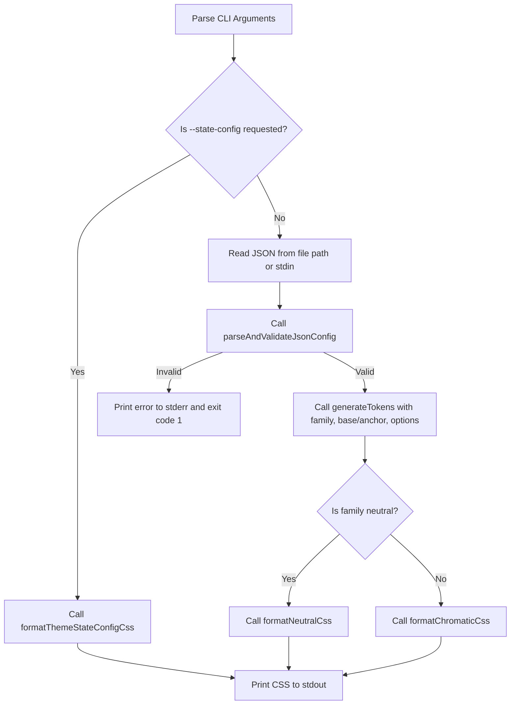

# Color Token Generator CLI & Default Theme Architecture

## 1. Overview and Goals

This specification details the design for a Deno-based Command-Line Interface (CLI) version of the MWI Color Token Generator, the configuration of the default Material Design 3 (MD3)-like theme, and the automated build pipeline via Makefile.

The CLI bridges the gap between the interactive browser-based tool ([`util/color-token-generator/`](util/color-token-generator/)) and headless/automated build environments, allowing developer workflows, CI/CD pipelines, and build tools to generate modular MWI token stylesheets directly from JSON configuration files.

### Key Objectives
1. **Headless Generation**: Execute token calculations and CSS formatting directly from Deno CLI without browser dependencies.
2. **Re-use Existing Math & Export Modules**: Directly import and leverage [`util/color-token-generator/js/color-engine.esm.js`](util/color-token-generator/js/color-engine.esm.js), [`util/color-token-generator/js/role-recipes.esm.js`](util/color-token-generator/js/role-recipes.esm.js), and [`util/color-token-generator/js/token-exporter.esm.js`](util/color-token-generator/js/token-exporter.esm.js).
3. **State Management CSS Flag**: Provide an explicit flag (`--state-config` / `--state`) to emit root/container state management CSS ([`formatThemeStateConfigCss()`](util/color-token-generator/js/token-exporter.esm.js:19)) to stdout.
4. **JSON Input Support**: Accept file paths or standard input (`stdin`) conforming to the JSON schema exported by the web tool.
5. **Default Theme Bundle**: Provide curated MD3-like JSON configurations under [`default-theme/`](default-theme/) for all 8 standard color families (`primary`, `secondary`, `tertiary`, `neutral`, `success`, `info`, `warning`, `error`).
6. **Makefile Integration**: Provide automated rules to compile `default-theme/*.json` into `dist/default-theme/*.css` along with `dist/default-theme/state.css`.

---

## 2. CLI Design & Specification

### 2.1 File Location and Runner Wrapper

- **CLI Implementation**: [`util/color-token-cli.esm.js`](util/color-token-cli.esm.js)
  - Executable shebang: `#!/usr/bin/env -S deno run --allow-read`
  - Pure ES module adhering to Deno standards.
- **Shell Wrapper**: [`bin/mwi-color-tokens`](bin/mwi-color-tokens)
  - Consistent with [`bin/md-to-mwi`](bin/md-to-mwi:1) and [`bin/mwi-to-html`](bin/mwi-to-html:1).
  - Forwards CLI arguments to `deno run --allow-read "$basedir/../util/color-token-cli.esm.js" "$@"`.

### 2.2 Command Line Interface & Options

```text
Usage:
  mwi-color-tokens [options] [config-file.json]
  deno run --allow-read util/color-token-cli.esm.js [options] [config-file.json]

Options:
  --state-config, --state   Output root theme state configuration CSS (color-scheme, mode defaults, cascade queries)
  -i, --input <file>        Input JSON configuration file path (defaults to positional argument or stdin)
  -h, --help                Display help information and exit
  -v, --version             Display version information and exit

Examples:
  # Output theme state configuration CSS
  mwi-color-tokens --state-config > dist/default-theme/state.css

  # Generate CSS from JSON file
  mwi-color-tokens default-theme/primary.json > dist/default-theme/primary.css

  # Pipe JSON via stdin
  cat default-theme/neutral.json | mwi-color-tokens - > dist/default-theme/neutral.css
```

### 2.3 Execution Flow & Core Modules



### 2.4 Modular Dependencies

The CLI imports functionality from existing generator modules:
- [`parseAndValidateJsonConfig()`](util/color-token-generator/js/token-exporter.esm.js:269)
- [`formatThemeStateConfigCss()`](util/color-token-generator/js/token-exporter.esm.js:19)
- [`formatChromaticCss()`](util/color-token-generator/js/token-exporter.esm.js:60)
- [`formatNeutralCss()`](util/color-token-generator/js/token-exporter.esm.js:129)
- [`generateTokens()`](util/color-token-generator/js/role-recipes.esm.js:590)

---

## 3. Default Theme Configuration (`default-theme/`)

The [`default-theme/`](default-theme/) directory stores declarative JSON configuration files reflecting MD3 design foundations for each color role.

### 3.1 Directory Structure
```
default-theme/
├── primary.json
├── secondary.json
├── tertiary.json
├── neutral.json
├── success.json
├── info.json
├── warning.json
└── error.json
```

### 3.2 Color Family Configurations

Each JSON file uses the standard v1.0 schema:

| File | Family | Strategy | Base OKLCH ($L, C, H$) | Default Hex | Purpose |
|---|---|---|---|---|---|
| [`default-theme/primary.json`](default-theme/primary.json) | `primary` | `tonal` | `0.55, 0.18, 260` | `#3454D1` | Core brand identity and primary actions |
| [`default-theme/secondary.json`](default-theme/secondary.json) | `secondary` | `tonal` | `0.60, 0.12, 210` | `#007A99` | Supporting accents and secondary components |
| [`default-theme/tertiary.json`](default-theme/tertiary.json) | `tertiary` | `tonal` | `0.65, 0.14, 150` | `#00825A` | Contrasting accents and visual balance |
| [`default-theme/neutral.json`](default-theme/neutral.json) | `neutral` | `tonal` | `0.55, 0.02, 260` | `#6E717E` | Generative surfaces, elevation steps, borders, and typography |
| [`default-theme/success.json`](default-theme/success.json) | `success` | `tonal` | `0.62, 0.17, 142` | `#1B873F` | Success states and positive badges |
| [`default-theme/info.json`](default-theme/info.json) | `info` | `tonal` | `0.58, 0.16, 235` | `#0077B6` | Informational callouts and alerts |
| [`default-theme/warning.json`](default-theme/warning.json) | `warning` | `tonal` | `0.72, 0.16, 75` | `#C06A00` | Warning badges, alerts, and cautions |
| [`default-theme/error.json`](default-theme/error.json) | `error` | `tonal` | `0.55, 0.22, 25` | `#BA1A1A` | Critical alerts, errors, and destructive actions |

---

## 4. Build Pipeline & Makefile Architecture

### 4.1 Output Structure (`dist/default-theme/`)

Building the default theme compiles the declarative JSON configs and state config into:
```
dist/
└── default-theme/
    ├── state.css
    ├── primary.css
    ├── secondary.css
    ├── tertiary.css
    ├── neutral.css
    ├── success.css
    ├── info.css
    ├── warning.css
    ├── error.css
    └── bundle.css       # Generated via convenience target: make default-theme-bundle
```

### 4.2 Makefile Target Specifications

In the project [`Makefile`](Makefile:1):

```makefile
THEME_SRC_DIR := default-theme
THEME_DIST_DIR := dist/default-theme
CLI_TOOL := util/color-token-cli.esm.js

THEME_JSONS := $(wildcard $(THEME_SRC_DIR)/*.json)
THEME_CSS := $(patsubst $(THEME_SRC_DIR)/%.json,$(THEME_DIST_DIR)/%.css,$(THEME_JSONS))
THEME_STATE_CSS := $(THEME_DIST_DIR)/state.css
THEME_BUNDLE_CSS := $(THEME_DIST_DIR)/bundle.css

.PHONY: theme default-theme default-theme-bundle clean-default-theme

theme: default-theme

default-theme: $(THEME_STATE_CSS) $(THEME_CSS)

default-theme-bundle: $(THEME_BUNDLE_CSS)

$(THEME_DIST_DIR):
	mkdir -p $(THEME_DIST_DIR)

$(THEME_STATE_CSS): $(CLI_TOOL) | $(THEME_DIST_DIR)
	deno run --allow-read $(CLI_TOOL) --state-config > $@

$(THEME_DIST_DIR)/%.css: $(THEME_SRC_DIR)/%.json $(CLI_TOOL) | $(THEME_DIST_DIR)
	deno run --allow-read $(CLI_TOOL) $< > $@

$(THEME_BUNDLE_CSS): default-theme
	cat $(THEME_STATE_CSS) $(THEME_CSS) > $@

clean-default-theme:
	rm -rf $(THEME_DIST_DIR)
```

---

## 5. Automated Testing Strategy

A dedicated test suite in [`test/color-token-cli.test.js`](test/color-token-cli.test.js) (and registered under `make test`) will verify:
1. **CLI Flag Processing**: Verifies `--state-config`, `--help`, and `--version` outputs.
2. **File & Stdin Ingestion**: Tests parsing from file paths and piped JSON streams.
3. **Validation & Exit Codes**: Verifies error handling and exit codes for missing files, invalid JSON, and illegal color properties.
4. **Theme Build Output**: Validates that all generated CSS files in `dist/default-theme/*.css` contain expected `@container` queries, correct CSS Custom Properties, and valid sRGB hex values.

---

## 6. Documentation Specifications

A dedicated documentation guide will be provided in [`docs/Color-Tokens-CLI.md`](docs/Color-Tokens-CLI.md) (and referenced in the project docs).

### 6.1 Documentation Outline
1. **Introduction & Concepts**: Explains how the CLI, interactive browser tool, and default theme integrate.
2. **CLI Quickstart & Reference**:
   - Command syntax and argument reference.
   - Flag options (`--state-config`, `-i / --input`, `-h / --help`, `-v / --version`).
   - Stdin piping and file output redirection.
3. **Makefile Build Workflow**:
   - Building individual theme files: `make default-theme`
   - Building unified CSS bundle: `make default-theme-bundle`
   - Cleaning build artifacts: `make clean-default-theme`
4. **Manual Theme Reconstruction Tutorial**:
   - Step 1: Generating the root theme state configuration:
     ```bash
     bin/mwi-color-tokens --state-config > dist/default-theme/state.css
     ```
   - Step 2: Generating a color family stylesheet (e.g., Primary):
     ```bash
     bin/mwi-color-tokens default-theme/primary.json > dist/default-theme/primary.css
     ```
   - Step 3: Generating generative Neutral surfaces and typography:
     ```bash
     bin/mwi-color-tokens default-theme/neutral.json > dist/default-theme/neutral.css
     ```
   - Step 4: Loading modular theme stylesheets into an HTML document or bundler.
