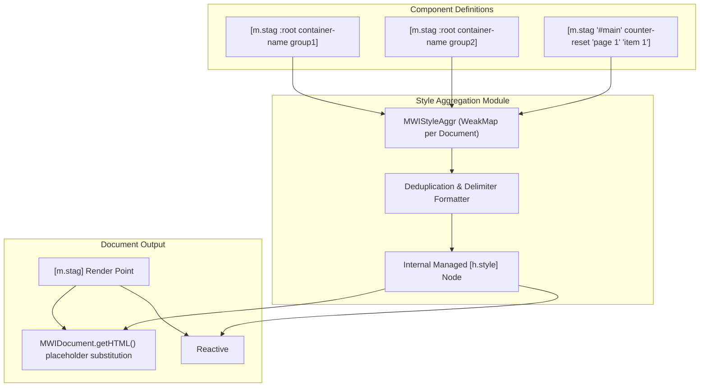

# Implementation Plan: CSS Style-Value Aggregation (`MWIStyleAggr`)

## 1. Problem Summary & Motivation

It is often useful for certain CSS attributes to support compound values assembled (aggregated) from multiple sources. For example, multiple distinct and unrelated components might each want to register their own `container-name` for the `:root` (`html`) element for the purpose of custom configuration via container queries, while retaining the ability to have more-localized values override for specific parts of a document:

```css
:root {
	container-name: group1 group2;
	/* group1 default settings */
	/* group2 default settings */
}
aside {
	container-name: group1;
	/* group1 aside override settings */
}
```

CSS does not currently support a way to declaratively build these incrementally from discrete rules. For example, there is no valid representation of the following conceptual pseudo-CSS:

```css
:root { container-name: none; } /* reset :root container names */
/* ... */
:root { container-name: + group1; } /* add group1 as a :root container-name */
/* ... */
:root { container-name: + group2; } /* add group2 as a :root container-name */
```

The `MWIStyleAggr` module (`[m.stag]`) provides this functionality by extending MWI's aggregation capabilities to cover specific CSS attributes.

---

## 2. Architecture & Design

### 2.1 Overview Diagram



### 2.2 Key Components and Interfaces

1. **Interface & Feature**:
   - Interface name: `MWIStyleAggr`
   - Feature identifier: `mwi.comp.MWIStyleAggr`
   - Component tag: `m.stag`
   - Module location: Dedicated module [`src/mwi-style-aggr-comp.msjs`](src/mwi-style-aggr-comp.msjs).

2. **Dual Component Usage Patterns**:
   - **Collector Mode** (`[m.stag selector attribute value...]`):
     - Example: `[m.stag :root container-name theme]`
     - Example: `[m.stag '#node' counter-reset 'page 1' 'paragraph 1']`
     - Registers values for the specified selector and attribute. Renders empty string in SSR and empty NANOS in CSR.
   - **Render Mode** (`[m.stag]`):
     - Bare node indicating the single render location of the aggregated `<style>` tag (typically in `<head>`).
     - Emits a placeholder `<{id}>` in SSR and delegates to a managed `[h.style]` node in CSR.

3. **`MWIDocument` Dynamic Callback Protocol**:
   - Updates to [`MWIDocument.prototype.getHTML()`](src/mwi-document.msjs:136) `process` function: support function-typed entries in `aggrData`. When a placeholder references an entry whose value is a function, `MWIDocument` calls `callback('getHTML', doc)` to retrieve dynamic SSR content.
   - Updates to [`clearAggr()`](src/mwi-document.msjs:40) in [`MWIDocument`](src/mwi-document.msjs:49): iterate over `aggrData` and invoke `callback('clear', doc)` for function entries before clearing.

4. **Internal `[h.style]` Node Management**:
   - Rather than duplicating CSS escaping, `<style>` tag markup creation, and DOM sync hydration logic, the render node instantiates and manages an internal `[h.style]` node (via `doc.createNode('h.style')`).
   - For SSR: `callback('getHTML', doc)` sets `m.text` on the managed `[h.style]` node and calls `getHTML()`, cleanly inheriting CSS closing tag sanitization (`\3c /style>`).
   - For CSR: `getDOM({ sync })` dynamically tracks the aggregated stylesheet content, updates `m.text` on the managed `[h.style]` node, and delegates DOM creation and [`MWIDOMSync`](src/mwi-doc-node.msjs:25) hydration directly to `[h.style]`.

---

## 3. Technical Specification

### 3.1 Supported Attributes & Value Separators

| CSS Attribute | Separator | Notes / Syntax |
| :--- | :--- | :--- |
| `anchor-name` | `, ` (comma) | Comma-separated list of anchor names |
| `anchor-scope` | `, ` (comma) | Comma-separated list of scopes |
| `container-name` | ` ` (space) | Space-separated list of container identifiers |
| `container-type` | ` ` (space) | Space-separated list of container types |
| `counter-increment` | ` ` (space) | Space-separated list of `<name> <optional-integer>` |
| `counter-reset` | ` ` (space) | Space-separated list of `<name> <optional-integer>`, supports `reverse(<name>)` |
| `counter-set` | ` ` (space) | Space-separated list of `<name> <optional-integer>` |
| `timeline-scope` | `, ` (comma) | Comma-separated list of timeline names |
| `view-timeline-name` | `, ` (comma) | Comma-separated list of timeline names |

**Unsupported Attributes**:
- `scroll-timeline-name` and any other unlisted attributes are explicitly unsupported.
- Attempting to aggregate an unsupported attribute name generates an error-level message (`console.error`).
- Value-conflict-detection-and-reporting (e.g., conflicting `counter-reset` on the same counter name with different numbers) is not supported in the initial release; duplicate identical strings are consolidated via deduplication.

### 3.2 Deduplication and Assembly Rules

1. **Deduplication**:
   - Component values are deduplicated per `(selector, attribute)` pair preserving first-seen order.
   - Multiple requests to add identical values (e.g., `container-name` of `group1` to `:root`) are consolidated to a single occurrence.
2. **Rule Grouping & Formatting**:
   - Declarations are grouped by selector based on tree-traversal order of the first occurrence of each selector.
   - Multiple attributes for the same selector are grouped within a single CSS rule block:
     ```css
     :root { container-name: group1 group2; counter-reset: page 1; }
     ```
   - Clean, single-level formatting with consistent spacing is emitted.
3. **Escaping**:
   - Handled automatically via internal `[h.style]` node, ensuring `</style>` is sanitized to `\3c /style>`.

### 3.3 Document State Management

- `MWIStyleAggr` maintains a module-level `WeakMap<MWIDocument, StyleAggrState>`.
- `StyleAggrState` contains:
  - `selectors`: Map of `selector -> Map<attribute, Set<string>>` for registered values.
  - `nodes`: `NANOS` list of registered collector nodes for CSR reactivity.
  - `styleNode`: The managed `[h.style]` doc node.
  - `bufferId`: Assigned buffer placeholder ID for SSR (`doc.mapAggrBuffer('m.stag')`).
- On first collector or render node initialization for a document:
  - Register callback in `doc.getAggr()`: `aggrData.set('m.stag', callback)`.
  - Callback handles:
    - `callback('getHTML', doc)`: Computes final `<style>` SSR markup via managed `h.style` node.
    - `callback('clear', doc)`: Cleans up document's `WeakMap` entry.

---

## 4. Implementation Tasks

### Phase 1: Core Document Extension
- [x] **Task 1.1: Enhance [`MWIDocument.prototype.getHTML()`](src/mwi-document.msjs:136)**
  - Update `process()` in [`src/mwi-document.msjs`](src/mwi-document.msjs:151) to check if placeholder replacement entry is a function.
  - If `typeof part === 'function'`, call `part('getHTML', doc)` and process the returned HTML string recursively.
- [x] **Task 1.2: Enhance [`clearAggr()`](src/mwi-document.msjs:40)**
  - Update [`clearAggr()`](src/mwi-document.msjs:40) in [`src/mwi-document.msjs`](src/mwi-document.msjs:40) to scan `aggrData.values()`.
  - If a value is a function, invoke `value('clear', doc)` before clearing maps.

### Phase 2: Dedicated `MWIStyleAggr` Component Implementation
- [x] **Task 2.1: Create [`src/mwi-style-aggr-comp.msjs`](src/mwi-style-aggr-comp.msjs)**
  - Define `MWIStyleAggr` interface and register `m.stag` with `MWIRegistry` with schema `{ autoDoc: false }`.
  - Declare `featreq: 'mwi.compRegOpen MWIDocNode MWIDocument mwi.comp.MWIHTMLScript'` and `featpro: 'mwi.comp.MWIStyleAggr'`.
- [x] **Task 2.2: Implement Positional Argument Parsing & Attribute Validation**
  - Distinguish between Render Mode (`subSpec.length === 0`) and Collector Mode (`subSpec.length >= 2`).
  - Extract `selector = subSpec[0]`, `attribute = subSpec[1]`, `values = subSpec.slice(2)`.
  - Validate attribute against supported set; log/throw error for unsupported attributes (such as `scroll-timeline-name`).
- [x] **Task 2.3: Implement SSR Assembly & Render Callback**
  - Collector nodes record rules into document `StyleAggrState` and return `''`.
  - Render node registers callback in `doc.getAggr()`, calls `doc.mapAggrBuffer('m.stag')`, and returns `<{bufferId}>`.
  - `callback('getHTML', doc)` formats CSS rules, updates `m.text` on internal `[h.style]` node, and calls `getHTML()`.
- [x] **Task 2.4: Implement CSR Reactive Assembly & DOM Sync Hydration**
  - Collector nodes register themselves in reactive buffer on `getDOM()`.
  - Render node evaluates two-phase CSR (`doc.initialCSR`).
  - On reactive evaluation, sort collector nodes by node path, assemble CSS, update managed `[h.style]` node's `m.text`, and return `h.style.getDOM({ sync })`.

---

## 5. Test Plan

### 5.1 Unit Tests — SSR HTML (`test/ssr-html/style-aggr.test.js`)
- [x] **Basic aggregation**: Single `[m.stag :root container-name group1]` and render `[m.stag]` producing `:root { container-name: group1; }` inside `<style>`.
- [x] **Deduplication**: Multiple identical `[m.stag :root container-name group1]` nodes resulting in single value `group1`.
- [x] **Delimiter handling**:
  - Space-separated attributes (`container-name`, `counter-reset`, `container-type`, `counter-increment`, `counter-set`).
  - Comma-separated attributes (`anchor-name`, `anchor-scope`, `timeline-scope`, `view-timeline-name`).
- [x] **Multiple values in single node**: `[m.stag '#node' counter-reset 'page 1' 'paragraph 1']`.
- [x] **Multiple selectors and properties**: Grouping multiple properties under same selector and handling multiple distinct selectors in first-seen order.
- [x] **Special syntax**: `reverse(name)` in `counter-reset`.
- [x] **Unsupported attribute handling**: Verify error message generation when encountering `scroll-timeline-name` or unknown attributes.
- [x] **Sanitization**: Verify `</style>` inside values is sanitized as `\3c /style>`.
- [x] **Document clear**: Verify `clearAggr` cleans up style aggregation state.
- [x] **`m.csr` suppression**: Verify `m.csr` on render node suppresses SSR output.

### 5.2 Unit Tests — CSR DOM (`test/csr-dom/style-aggr.test.js`)
- [x] **CSR rendering**: Mount `[m.stag]` render node and collector nodes in simulated browser; verify `<style>` element content.
- [x] **Reactive additions**: Dynamically appending a new `[m.stag]` collector node updates the `<style>` element reactively.
- [x] **Reactive updates**: Modifying attributes or subSpec on existing collector node reactively updates stylesheet.
- [x] **Two-phase mounting**: Verify `initialCSR` deferral resolves accurately when document completes initial mount.

### 5.3 Hydration Tests (`test/ssr-csr-hyd/style-aggr-sync.test.js`)
- [x] **SSR-to-CSR Hydration**: Verify SSR rendered `<style>` element is matched and reused by `MWIDOMSync` without DOM node replacement.
- [x] **Post-hydration reactivity**: Verify mutations after hydration update the synced `<style>` node.

---

## 6. Documentation Plan

- [x] **Interface Documentation**:
  - Create [`docs/interfaces/MWIStyleAggr-style-aggregation.md`](docs/interfaces/MWIStyleAggr-style-aggregation.md) matching standard interface doc format.
  - Detail supported CSS attributes, value separators, syntax examples for collector and render nodes, and deduplication rules.
- [x] **Document Coordinator Update**:
  - Update [`docs/interfaces/MWIDocument-document.md`](docs/interfaces/MWIDocument-document.md) to document callback-function entries in `aggrData` for dynamic placeholder substitution and cleanup.
- [x] **Reference Updates**:
  - Update [`docs/Reactive-Patterns.md`](docs/Reactive-Patterns.md) and [`docs/Glossary.md`](docs/Glossary.md) with `m.stag` and style aggregation concepts.

---

## 7. Open Issues & Resolutions

1. **Positional Arguments vs Named Attributes**:
   - *Resolution*: Initial implementation supports positional arguments (`[m.stag selector attribute value...]`). Named attributes (e.g. `selector="..." attr="..."`) may be considered in a future enhancement.
2. **Multiple Render Points**:
   - *Resolution*: Document duplicate rendering as unsupported (applies per-context to all aggregation).
   - SSR consistently returns the same placeholder/buffer ID; duplicate replacement of an already replaced buffer ID generates a warning/error in `MWIDocument`.
   - CSR returns the same DOM node; duplicate insertion in multiple places in the DOM tree is volatile.
3. **Minification vs Pretty-Printing**:
   - *Resolution*: Emit clean, single-level formatted CSS rules (`selector { prop: val; }`) with consistent spacing for both SSR and CSR parity.
4. **Ordering of CSS Rule Blocks**:
   - *Resolution*: Preserve selector order based on tree-traversal occurrence of the first `m.stag` targeting that selector.
